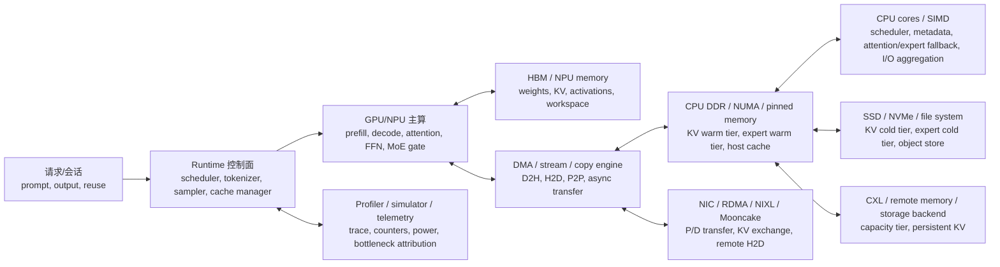

# 大模型推理硬件层面对照地图

日期：2026-07-01  
项目语境：面向 A+K / Ascend NPU + Kunpeng CPU 小算力一体机的大模型推理落地、性能建模与仿真系统构建。  
证据基础：本地第三轮可核验 Deep Research 报告、`references/bibliography_inference_sim.md`、本地 PDF 与官方网页快照。  
使用方式：本文不是按“算法方向”分类，而是按一次推理请求实际穿过的硬件链路分类，用来回答“代表性工作到底动了哪些硬件层、解决了什么硬件瓶颈、给仿真器留下哪些字段”。

## 0. 总体判断

大模型推理的硬件问题已经从“单卡算力不够”转成“状态对象放在哪里、什么时候搬、由谁搬、搬运是否挡住主链路”的问题。代表性工作可以按四类硬件路径理解：

| 路径 | 核心问题 | 代表工作 | 对小算力系统的含义 |
|---|---|---|---|
| GPU/NPU + CPU 协同 | HBM/NPU 内存不足，但 CPU 直接上主链路容易拖慢 | NEO、FlexInfer、llm.npu、KTransformers | CPU/Kunpeng 应先做 warm tier、控制面、稀疏/冷路径和可重叠计算，不能笼统说“CPU 加速推理” |
| KV / expert / prefix 状态分层 | KV cache 与 MoE expert 抢 HBM，随上下文和并发增长 | Mooncake、LMCache、FineMoE、DALI、FluxMoE、vLLM-Ascend UCM | 需要统一 state object：KV、expert、prefix、weight、latent 都要有大小、热度、位置、迁移代价 |
| 互联与存储数据面 | PCIe、RDMA、SSD、CXL、NIXL、Mooncake transfer 决定 offload 是否赚钱 | Tutti、Bidaw、SolidAttention、Dynamo、TensorRT-LLM DS | SSD/CXL/远端内存只能做温层或冷层；没有 direct/object I/O 和 overlap 时会反噬 |
| 仿真与规格反推 | FLOPs roofline 解释不了 TTFT/TPOT/P99/容量边界 | ServeGen、ProfInfer、LLMServingSim2.0、BurstGPT | 仿真器必须记录 workload、operator timeline、memory/IO/power、cache hit/miss 和 transfer stall |

最重要的工程结论是：任何 offload 机制都要同时说明三个条件：被 offload 的对象是什么、跨了哪条硬件链路、是否能被主计算流水线隐藏。只写“CPU/SSD 扩容”是不够的。

## 1. 推理请求的硬件全景图



这张图有两个主链路：

- 热路径：`Runtime -> GPU/NPU -> HBM -> decode token`。热路径上的任何 CPU 同步、PCIe 往返、SSD 小 I/O 都会直接抬高 TPOT/P99。
- 冷/温路径：`HBM <-> CPU DDR <-> SSD/remote`。它的价值是提升上下文长度、并发、prefix reuse 和 MoE 模型容量，但必须靠异步、预取、分层和调度隐藏。

## 2. 硬件层级地图

| 层级 | 具体硬件/状态 | 主要瓶颈 | 代表工作怎么处理 | 需要记录的仿真字段 |
|---|---|---|---|---|
| L0 workload 与阶段 | arrival、prompt/output 长度、session reuse、agent idle、prefill/decode | 平均负载掩盖 burst、prefix reuse 和长尾 | ServeGen 做真实 workload characterization；BurstGPT 提供 burst trace；LLMServingSim2.0 做 trace-driven replay | arrival process、prompt/output 分布、reuse distance、并发、SLO |
| L1 加速器计算核心 | GPU SM/Tensor Core、Ascend AI Core/Cube、mobile NPU INT8 单元 | prefill 算力密集，decode 小 batch 利用率低 | llm.npu 把 prefill 尽量放 NPU；NEO 保留 GPU 线性层并把部分 decode attention 放 CPU；FlexInfer 按 phase 选 CPU/GPU 策略 | operator latency by shape、batch evolution、utilization、kernel launch overhead |
| L2 加速器片上/本地内存 | HBM/GDDR/NPU memory、L2/SRAM、workspace | KV、weights、activation、workspace 抢容量 | PagedAttention/LMCache/Mooncake/UCM 把 KV 对象化；FineMoE/DALI/FluxMoE 把 expert 对象化 | HBM occupancy、block size、KV bytes/token、expert size、eviction count |
| L3 加速器状态布局 | KV block、prefix tree、expert cache、paged layout | 逻辑连续对象被物理分页打散，恢复时变成小 I/O | Tutti 把 KV 变成 GPU-native object；CacheSlide 处理 prefix 位置偏移；SolidAttention 用粗粒度 KV blocks 和稀疏访问 | object ID、layer/block layout、fragmentation、I/O size distribution |
| L4 DMA 与设备流 | PCIe DMA、D2H/H2D、copy engine、NPU stream、P2P | 传输和同步挡住主链路 | NEO 避免反复 KV swap，改为 CPU 侧 attention；vLLM-Ascend 用独立 NPU stream 做 D2H/H2D；Tutti 去掉 CPU critical I/O path | transfer bytes、setup latency、overlap ratio、sync barrier、stall attribution |
| L5 CPU 计算 | x86 AMX/AVX-512、ARM SVE/SME、Kunpeng cores | CPU FLOPs 弱，但内存容量大；小矩阵/同步开销高 | KTransformers 用 AMX expert kernel 和 Expert Deferral；FlexInfer 引入 CPU computation policy；NEO 只 offload 部分 decode attention | CPU kernel latency、SIMD ISA、cores、cache miss、CPU utilization |
| L6 CPU 内存与 NUMA | DDR、NUMA socket、pinned memory、CPU KV pool、host cache | DDR 带宽、NUMA 跨 socket、host OOM、pinned buffer 争用 | NEO 利用 host CPU memory 放 KV；KTransformers 做 NUMA-aware tensor placement；Bidaw 用 host memory + SSD 两级 KV | DDR bandwidth、NUMA locality、pool hit/miss、pinned bytes、host OOM |
| L7 机内互联 | PCIe 4/5、NVLink/NVSwitch、UB/HCCS/HCCL、CXL.mem | 带宽/延迟决定 offload 边界；小粒度频繁往返最危险 | FlexInfer 证明 PCIe data load 可支配 offload 时间；Mooncake/TensorRT-LLM/Dynamo 显式建模 KV transfer；ITME 把 CXL 作为容量层 | per-link bandwidth/latency、P2P capability、queue depth、contention |
| L8 本地存储 | NVMe SSD、SSD queue、file system、GDS、GPU io_uring、Mooncake SSD offload | 账面带宽高但 tiny random I/O、CPU control path 和 DRAM-HBM copy 会反噬 | Tutti 用 GPU-centric object I/O；Bidaw 做 two-tier storage-aware scheduling；SolidAttention 做 sparse KV + SSD orchestration；vLLM-Ascend KV Pool 支持 Mooncake SSD offload | SSD seq/random BW、IOPS、I/O size、submit/completion path、buffer alignment |
| L9 远端数据面 | RDMA、RoCE/IB、NIXL、Mooncake Transfer Engine、remote H2D | P/D 分离后 KV transfer 可能比计算更贵 | Mooncake 做 KVCache-centric disaggregation；vLLM NixlConnector/Dynamo 用 NIXL 和 KV-aware routing；vLLM-Ascend KV Pool 提供 MooncakeConnectorV1 | KV transfer bytes、network RTT/BW、routing policy、remote hit/miss、backpressure |
| L10 运行时控制面 | scheduler、queue、cache manager、metadata、connector API | cache 命中和硬件利用由调度决定，不是硬件自动解决 | NEO load-aware scheduling；Mooncake Conductor；Bidaw ready/preparing queue；UCM/LMCache/vLLM connectors | queueing delay、policy decision、object lifecycle、TTL、QoS |
| L11 可观测与能耗 | profiler、counters、power、temperature、trace schema | 无法判断瓶颈是在 compute、copy、I/O、queue 还是 cache miss | ProfInfer 做 timeline/counter；LLMServingSim2.0 做 operator-level profiler + memory/power simulator | TTFT、TPOT、P95/P99、energy/token、power curve、simulation error |

## 3. 代表性工作的硬件对照矩阵

| 工作 | 主硬件链路 | 涉及层级 | 解决的问题 | 核心做法 | 仍需注意的边界 |
|---|---|---|---|---|---|
| NEO | GPU HBM + PCIe + CPU cores + CPU DDR | L1/L2/L4/L5/L6/L10 | GPU memory 限制 batch/concurrency，单纯 KV swap 会被 PCIe 带宽卡住 | 把部分 decode attention compute 和 KV 状态放到本地 CPU；GPU 继续跑线性/主算；用 asymmetric GPU-CPU pipeline 和 load-aware scheduling 平衡 CPU/GPU | CPU 内存带宽和 kernel 能力是上限；只适合可重叠、内存带宽型 decode attention 子路径 |
| FlexInfer | 单 GPU + CPU + PCIe + CPU matrix unit | L1/L4/L5/L7/L10 | offloading 模型权重/KV 到 CPU memory 后，PCIe data load 暴露时间过高 | 在 CPU computation、GPU offload execution、CPU-GPU static partitioning 间按 phase、batch、seq length、硬件配置选择策略 | 大 batch/长输入时 CPU compute 可能变瓶颈；策略需要硬件实测参数 |
| llm.npu | mobile NPU + CPU/GPU + SoC memory | L1/L3/L5/L10/L11 | 端侧 prefill 慢，NPU 静态 shape、outlier、FP operator 支持弱 | prompt chunk-sharing graph、shadow outlier CPU/GPU parallel execution、out-of-order subgraph scheduling | 主要覆盖移动端 prefill；与服务器 Ascend/Kunpeng 不能直接等价，但 NPU/CPU 异构调度思想有参考价值 |
| KTransformers | GPU VRAM + CPU DDR + AMX/AVX + NUMA + CUDA Graph | L2/L5/L6/L10 | 本地大 MoE 放不进 GPU，expert weight 频繁 PCIe 搬运会慢 | shared/hot experts 留 GPU，routed experts 放 CPU；AMX-specialized expert kernel；NUMA-aware placement；Expert Deferral 重叠 CPU/GPU | 强依赖 CPU ISA 和内存带宽；Kunpeng SVE 需要独立 microbenchmark |
| FineMoE | GPU memory + CPU memory + expert cache | L2/L3/L6/L10 | coarse expert offload 导致 miss 多、延迟高或显存占用高 | expert map 记录 iteration-level expert distribution，结合 semantic hints 做 prefetch/cache/offload | router 可预测性不足时收益下降；需要 expert trace 和 hit/miss 实测 |
| DALI / FluxMoE | GPU HBM + CPU/SSD warm/cold expert tiers | L2/L3/L6/L8/L10 | 静态 expert 放置不能适配 workload，expert 与 KV 争 HBM | workload-aware assignment、expert paging、transient expert object、prefetch/replacement | 错误预取会挤占 HBM；decode miss 位于关键路径时反噬 |
| Mooncake | GPU/VRAM + CPU/DRAM/SSD + RDMA + global scheduler | L2/L6/L8/L9/L10 | 长上下文和多轮对话下 KV 复用/迁移/调度成为中心问题 | KVCache-centric disaggregation；prefill/decode 分离；CPU/DRAM/SSD 组成 disaggregated KV pool；Conductor 做 KV-aware scheduling | P/D 拆分只在长上下文、高复用、可重叠 transfer 下赚钱 |
| LMCache / UCM | HBM + DRAM + storage backend | L2/L3/L6/L8/L10 | prefix/KV 复用局限在单 engine 或单设备内存 | KV object API、多级 storage backend、pin/lookup/move/compress/evict；UCM 用 HBM -> DRAM -> SSD/NFS/3FS 分层 | object consistency、TTL、跨 DP 命中和 storage backend 延迟要单独建模 |
| Bidaw | GPU + host memory + SSD two-tier storage | L6/L8/L10 | 交互式多轮 KV 从两级存储加载时，慢 I/O 请求阻塞快请求 | compute-storage 双向感知；ready/preparing queue；按 KV 所在层和大小调度；用响应长度预测 eviction | 依赖对用户下一次访问的预测；适合多轮会话 KV，而非所有 workload |
| SolidAttention | GPU/HBM + SSD + sparse KV blocks | L2/L3/L8/L10 | 内存受限 PC 上长上下文 sparse attention 与 SSD 管理耦合 | coarse KV blocks、speculative prefetch、I/O orchestration，降低 KV footprint | 适合 sparse attention/长上下文；dense attention 不一定同样收益 |
| CacheSlide | prefix/KV cache + position-dependent attention | L3/L10 | agent workflow 中 prefix 位置变化导致 cache 不能直接复用 | relative-position-dependent caching 和 correction 机制 | 主要解决位置偏移下的 cache reuse，不解决底层 SSD/PCIe 瓶颈 |
| Tutti | HBM + NVMe SSD + GPU direct/object I/O + GPU io_uring | L3/L4/L8/L11 | SSD-backed KV 被 tiny random I/O、CPU-centric GDS control path、DRAM-HBM copy 和 GPU stall 反噬 | GPU-native KV object store；GPU io_uring；slack-aware I/O scheduling；从 HBM 到 SSD 去 CPU critical path | 对 Ascend 迁移的关键问题是是否有 NPU-native storage submission/direct path |
| vLLM-Ascend KV Cache CPU Offload | Ascend NPU memory + CPU memory + NPU D2H/H2D stream | L2/L4/L6/L10 | NPU memory 不足时 inactive KV 无法容纳更多 context/concurrency | OffloadingConnector + NPUOffloadingSpec；D2H/H2D 独立 NPU stream；CPU LRU block pool | host OOM、copy stall、prefix hit 率不足时收益有限 |
| vLLM-Ascend UCM / KV Pool | Ascend HBM + local DRAM + SSD/NFS/3FS + Mooncake | L2/L6/L8/L9/L10 | prefix cache 容量和持久化受设备内存限制，P/D KV pool 需要实际接口 | UCM external KV；HBM -> DRAM -> storage backend；MooncakeConnectorV1 + AscendStoreConnector；Mooncake SSD offload | fabric memory 对齐、buffer 大小、TTL、failure policy 和 remote H2D 需要工程验证 |
| NVIDIA Dynamo KVBM / LMCache / FlexKV | GPU memory + CPU RAM + disk + NIXL transport | L2/L8/L9/L10 | 工业化 vLLM serving 需要统一 KV offload backend 与 KV-aware routing | KVBM 三层架构、CPU/disk tiers、LMCache/FlexKV backend、aggregated/disaggregated deployment | CUDA/NVIDIA 生态证据不能直接推导 Ascend；但 data-plane 抽象值得对标 |
| ServeGen | workload trace + simulator input | L0/L11 | synthetic workload 不真实，导致仿真器结论无法落地 | per-client workload characterization/generation | 不解决硬件模型本身，但决定仿真 workload 可信度 |
| ProfInfer | runtime timeline + counters | L10/L11 | 端到端延迟无法分解到算子、队列、拷贝、I/O | eBPF/timeline/counter 对齐，定位 bottleneck | 需要和 Ascend/CANN counters 对齐 |
| LLMServingSim2.0 | heterogeneous hardware + memory/network/power model | L0/L1/L2/L7/L9/L11 | 传统仿真器难覆盖异构硬件、MoE、prefix cache、P/D 和 offload | trace-driven operator profiler；heterogeneous instances；MoE expert offloading；prefix cache manager；memory/power/system simulator | 本地有版本线索待 canonical 确认；迁移到 Ascend/Kunpeng 仍需硬件 profile |

## 4. 以 NEO 为例的硬件拆解

NEO 不是一个普通的“CPU offload KV cache”工作。它的硬件链路可以拆成如下几段：

| 子链路 | NEO 做了什么 | 解决的硬件问题 | 对仿真器的字段 |
|---|---|---|---|
| GPU/HBM | GPU 保留主计算和未 offload 请求的 KV/attention | HBM 容量限制 batch size，但 GPU compute 仍有空闲 | GPU memory capacity、HBM occupancy、GPU attention/FFN latency |
| CPU/DDR | CPU 存放被 offload 请求的 KV，并执行对应 decode attention | 避免每个 decode step 都把整段 KV 经 PCIe 换入 GPU | CPU KV bytes、DDR bandwidth、CPU attention latency |
| PCIe/DMA | 只传 Q/K/V 或 attention output 等必要张量，而不是反复搬整段 KV | 降低 PCIe bandwidth bottleneck；减少 D2H/H2D 往返暴露时间 | transfer bytes per token、PCIe latency/BW、DMA setup |
| GPU-CPU pipeline | GPU 子 batch 与 CPU 子 batch 并行；GPU 跑线性层/主路径，CPU 跑 offloaded attention | CPU 慢但可以被 GPU 工作重叠；提升总 batch/concurrency | overlap ratio、pipeline bubble、per-stage queue |
| load-aware scheduler | 在线监测 CPU/GPU 队列，决定哪些 request offload 到 CPU | 静态策略无法适配真实请求长度和队列变化 | CPU/GPU runqueue、policy decision、waiting time |
| 性能边界 | CPU 不能承接过多 attention；否则 CPU memory bandwidth 和 kernel 会成为瓶颈 | 防止“扩容成功但 TPOT/P99 变差” | offload ratio、CPU utilization、P95/P99 TPOT |

用这套拆解看 NEO，可以得到一个更一般的判断标准：CPU 参与推理只有在“状态留在 CPU 侧、计算也留在 CPU 侧、跨链路传输足够小、执行能与主链路重叠”时才可能赚钱。

## 5. 关键硬件组件与设计问题

### 5.1 GPU/NPU 主算层

需要区分 prefill 和 decode：

- prefill：大矩阵和长序列并行，主要吃 Tensor Core/AI Core/Cube、HBM 带宽和 attention 算法。
- decode：单 token 迭代、小 batch、频繁读 KV，容易从 compute-bound 变成 memory/scheduler-bound。
- MoE：gate 本身小，但 expert weight 巨大；top-k routing 决定 expert 热度和 all-to-all/transfer。

对应设计问题：

| 问题 | 代表工作 | 设计含义 |
|---|---|---|
| NPU/GPU 主算是否被 HBM 容量限制 | NEO、FlexInfer、vLLM-Ascend KV CPU Offload | 先测 HBM occupancy 和 max concurrency，再谈 offload |
| prefill 和 decode 是否应该分离 | Mooncake、TensorRT-LLM DS、Dynamo、vLLM NixlConnector | P/D 拆分前必须测 KV transfer 是否可重叠 |
| NPU 对某些算子支持弱 | llm.npu | 对 outlier、FP operator、dynamic shape 做 CPU/GPU fallback 或图重写 |

### 5.2 HBM/NPU memory 与状态对象层

HBM 里真正争空间的不是一个对象，而是一组状态：

| 状态对象 | 增长原因 | 代表工作 | 硬件动作 |
|---|---|---|---|
| KV cache | context length、batch、concurrency、layers | Mooncake、LMCache、Tutti、Bidaw、UCM | block 化、prefix reuse、HBM/DRAM/SSD 分层、restore/recompute |
| MoE expert | expert count、hidden size、precision | KTransformers、FineMoE、DALI、FluxMoE | hot experts 常驻，warm experts 放 CPU/DRAM，cold experts 放 SSD/remote |
| weights | 模型参数规模、量化策略 | FlexInfer、KTransformers | layer-wise load、CPU compute、expert offload |
| activation/workspace | batch、sequence、attention kernel | llm.npu、SolidAttention | chunking、sparse attention、workspace reuse |
| prefix/radix tree metadata | session reuse、agent workflow | CacheSlide、LLMServingSim2.0、UCM | prefix index、position correction、TTL、external KV |

对仿真器而言，这些都应统一成 state object，而不是分别写死在 KV 或 expert 模块里。每个对象至少需要：`object_type`、`bytes`、`layer`、`owner_request`、`tier`、`hotness`、`next_use`、`load_cost`、`evict_cost`、`recompute_cost`、`consistency_scope`。

### 5.3 CPU/Kunpeng 层

CPU 在推理里有五种角色，不能混成一个“CPU 加速”：

| CPU 角色 | 适合做什么 | 代表工作 | A+K 对应 |
|---|---|---|---|
| 控制面 | scheduling、metadata、cache index、routing、tokenizer/sampler | Mooncake、Bidaw、UCM、Dynamo | Kunpeng P0：metadata manager、KV/index manager |
| warm tier | CPU DRAM 存 KV、expert、prefix | NEO、Bidaw、vLLM-Ascend KV CPU Offload | Kunpeng P0：CPU DRAM KV warm tier |
| 可重叠计算 | decode attention 子路径、低频 expert、outlier fallback | NEO、FlexInfer、llm.npu | Kunpeng P1/P2：需要逐 shape/SVE 实测 |
| 高效 expert compute | AMX/AVX/SVE expert kernel | KTransformers | Kunpeng 不能直接继承 AMX 结果，需 SVE kernel 证明 |
| I/O aggregation | SSD/NFS/3FS/Mooncake client、RDMA/NIXL coordination | Mooncake、UCM、Tutti 对照 | Kunpeng P1/P2：I/O 聚合和 buffer 管理 |

需要实测的硬件指标：CPU memory bandwidth、NUMA remote penalty、CPU kernel by shape、pinned memory allocation latency、D2H/H2D overlap、CPU package power、host OOM 行为。

### 5.4 互联与 DMA 层

互联层决定 offload 是扩容还是反噬：

| 链路 | 常见问题 | 代表工作 | 仿真字段 |
|---|---|---|---|
| PCIe GPU/NPU <-> CPU | 带宽低于 HBM/DDR，setup 和同步成本高 | NEO、FlexInfer | bytes/token、D2H/H2D latency、DMA setup、overlap |
| NVLink/NVSwitch | 多 GPU KV/expert 并行传输 | TensorRT-LLM、Dynamo | P2P bandwidth、contention、routing |
| HCCS/HCCL/UB/Fabric Mem | Ascend 多卡/多机 KV transfer 与 PD | vLLM-Ascend KV Pool | fabric memory quota、alignment、remote H2D |
| RDMA/NIXL/Mooncake | P/D disaggregation、remote KV exchange | Mooncake、vLLM NixlConnector、Dynamo | transfer queue、RTT、RDMA BW、backpressure |
| CXL.mem | TB 级容量层或温层 | ITME | CXL latency/BW、access locality、page size |

判断规则：如果对象每次访问都在 hot path 上跨 PCIe/网络，通常不赚钱；如果对象可预测、可预取、可批量搬运，并且搬运可被其他 request 的 compute 覆盖，才可能赚钱。

### 5.5 SSD / NVMe / 外部存储层

SSD 的关键不是“容量大”，而是 I/O 粒度和控制路径。

| 问题 | 反例/正例 | 设计要求 |
|---|---|---|
| tiny random I/O | Tutti 指出 fragmented GPU page layout 会把 KV restore 变成大量小随机 I/O | KV object store 要能做 bulk transfer，避免 page-level 零碎访问 |
| CPU-centric control path | GDS 仍可能要求 CPU 发起 I/O，CPU 变瓶颈 | 需要 direct/object I/O；Ascend 侧对应 NPU-native storage path 仍是空白 |
| DRAM-HBM bounce copy | SSD -> DRAM -> HBM 会制造拷贝和同步 | 优先测 direct path、bounce buffer 和 copy stream |
| storage-aware scheduling | Bidaw 说明慢 SSD 请求会阻塞快 host-memory 请求 | scheduler 必须知道 KV 位于 host memory 还是 SSD、KV size 多大 |
| SSD buffer/对齐 | vLLM-Ascend KV Pool 的 Mooncake SSD offload 需要 buffer 与 fabric memory 对齐 | 需要把 buffer size、rank quota、TTL、failure policy 纳入工程配置 |

对小算力一体机，SSD KV 应放在 P2，而不是 P0。P0 应先做 HBM prefix/APC、CPU DRAM warm tier 和 UCM/Mooncake external KV；P2 再验证 SSD cold tier。

## 6. Ascend + Kunpeng 的硬件映射

| CUDA/NVIDIA 生态概念 | Ascend/Kunpeng 对应 | 当前可做 | 主要缺口 |
|---|---|---|---|
| GPU HBM | Ascend NPU memory / HBM | vLLM-Ascend KV CPU Offload、UCM、KV Pool | 精细 counters、KV block 生命周期 trace |
| CUDA stream / copy engine | NPU stream、CANN runtime D2H/H2D | NPUOffloadingSpec 已有独立 D2H/H2D stream 线索 | overlap 和 stall attribution 需要实测 |
| CPU RAM KV tier | Kunpeng DDR / pinned host memory | CPU KV warm tier、LRU block pool、metadata manager | NUMA、host OOM、pinned buffer 策略 |
| CPU AMX expert kernel | Kunpeng SVE/SME/向量化 kernel | 可做 microbenchmark 和 prototype | 没有公开强证据证明可直接承接 KTransformers |
| GDS / GPU direct storage | NPU -> SSD direct 或 NPU-side storage submission | 现阶段更现实是 Mooncake/UCM storage backend | NPU-native SSD direct path 公开证据不足 |
| NIXL/RDMA KV transfer | MooncakeConnectorV1、AscendStoreConnector、HCCL/HCCS/UB/Fabric Mem | KV Pool / PD / remote H2D 可作为 P1 原型 | fabric memory alignment、remote H2D 前置条件和故障策略 |
| GPU/CPU/disk KVBM | UCM / Mooncake / KV Pool / external KV | HBM -> DRAM -> SSD/NFS/3FS 分层可实现 | 统一 state object runtime 还缺一层抽象 |

推荐路线：

1. P0：建立 profiler/simulator trace，跑通 vLLM-Ascend KV Cache CPU Offload，记录 NPU HBM、CPU DDR、D2H/H2D、prefix hit/miss。
2. P1：引入 UCM / KV Pool / MooncakeConnectorV1，验证 P/D、external KV、Mooncake transfer 和 host memory pool。
3. P2：验证 Mooncake SSD offload / UCM storage backend，重点测 I/O 粒度、buffer 对齐、SSD quota、KV load failure。
4. P3：提出 NPU-native SSD/direct path 或 NPU-side async storage submission，作为硬件/运行时创新点。

## 7. 仿真器字段清单

硬件层面对照地图最终要落到仿真器 schema。建议最小字段如下：

| 模块 | 必备字段 |
|---|---|
| workload | request_id、arrival_time、prompt_tokens、output_tokens、session_id、prefix_id、reuse_distance、SLO |
| model | layers、hidden_size、heads、GQA/MQA、KV bytes/token、MoE expert count、top-k、precision |
| accelerator | device_type、HBM capacity、HBM bandwidth、operator latency by shape、stream count、copy engine、power curve |
| CPU | cores、ISA、NUMA sockets、DDR bandwidth、kernel latency by shape、pinned memory capacity、package power |
| interconnect | link_type、bandwidth、latency、setup_cost、P2P capability、congestion model |
| storage | tier_type、capacity、seq/random bandwidth、IOPS、I/O size distribution、queue depth、submit path、buffer alignment |
| state object | object_type、bytes、layer、tier、hotness、next_use_time、load_cost、evict_cost、recompute_cost、consistency_scope |
| scheduler | queue_state、policy_decision、cache_hit_layer、offload_ratio、prefetch_lead_time、eviction_reason |
| telemetry | TTFT、TPOT、P95/P99、throughput、goodput、stall_reason、energy/token、simulation_error |

每篇新论文或系统都可以用下面的卡片录入：

```text
工作名称：
状态对象：KV / expert / weight / activation / prefix / latent / mixed
主硬件路径：
热路径是否跨 CPU/PCIe/SSD/network：
冷/温路径放在哪一层：
解决的瓶颈：
依赖的 overlap 假设：
失败条件：
需要实测的硬件参数：
可迁移到 Ascend+Kunpeng 的部分：
不能直接迁移的部分：
```

## 8. 证据来源索引

本地图主要来自以下本地证据，不重新覆盖第三轮报告：

- `Deep Research 反向回顾报告 第三轮可核验版 小算力大模型推理落地与推理仿真系统构建.md`
- `references/bibliography_inference_sim.md`
- `references/papers/NEO__arxiv-2411.01142.pdf`
- `references/papers/FlexInfer.pdf`
- `references/papers/llm.npu__arxiv-2407.05858.pdf`
- `references/papers/KTransformers.pdf`
- `references/papers/fMoE-FineMoE__arxiv-2502.05370.pdf`
- `references/papers/DALI__arxiv-2602.03495.pdf`
- `references/papers/Mooncake__arxiv-2407.00079.pdf`
- `references/papers/Bidaw-FAST26.pdf`
- `references/papers/SolidAttention-FAST26.pdf`
- `references/papers/Tutti__arxiv-2605.03375.pdf`
- `references/papers/ServeGen-NSDI26.pdf`
- `references/papers/LLMServingSim-2.0__arxiv-2511.07229.pdf`
- `references/web/vLLM-Ascend-KV-CPU-offload-live.html`
- `references/web/vLLM-Ascend-UCM-deployment-live.html`
- `references/web/vLLM-Ascend-KV-pool-live.html`
- `references/web/NVIDIA-Dynamo-KV-offloading-live.html`

注意：旧缓存 `references/papers/Tutti__arxiv-2602.04182.pdf` 内容不符，不能作为 Tutti 证据。

