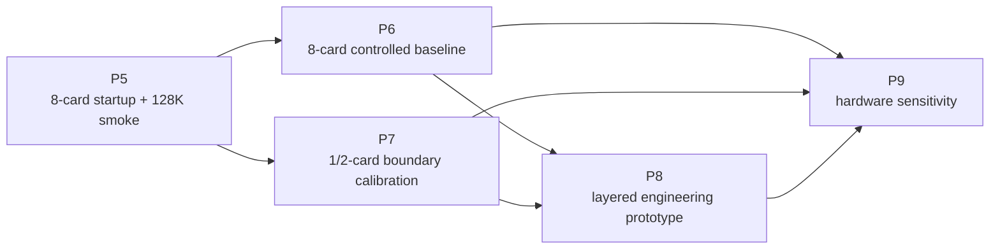

# P5-P9 实验计划

日期：2026-07-11

本文档是 P5-P9 的稳定阶段契约。P8 的工程细节见 `docs/P8_LAYERED_ENGINEERING_PROTOTYPE_PLAN.md`；每轮实时状态、服务器回传和下一动作写入 `工作记录与进度笔记本/`。

## 1. 当前起点

P0-P4 已建立两类可复用资产：

- P0/P3 hardware microbench 与服务器环境/可观测基线。
- P1 Qwen3.5-4B / vLLM 请求、长上下文、Prefix Cache、phase memory、msprof 和 request-device readout 链路。

这些资产能提供工具链、指标 schema 和校准输入，但不是 DeepSeek-V4-Flash 八卡性能结论。

当前服务器任务为 P5 官方 checkpoint runtime gate：

```text
p5_deepseek_v4_flash_4card_fp8_allocator_patch_delivery_v0221rc1_2026_0711
```

上一轮 `0.20.2/0.20.2rc1` 四卡探针已在 NPU 量化平台门得到 `diagnostic_red_quant_format`。项目现已停止使用 W8A8，主对象改为官方 mixed FP8+FP4 checkpoint。独立 `0.22.1/0.22.1rc1` 栈已通过核心版本、依赖分类、量化注册和模型 metadata 门，但四个 spawned worker 在权重加载前的 `MemorySnapshot` 同样命中 `Allocator for npu is not a DeviceAllocator`。当前先用 NPU 4 证明官方 NPU memory redirect 的 worker 传播状态；只有假设成立且 session-scoped overlay 验证成功，才用 NPU 4-7 复跑 base-no-MTP `4096+64` runtime gate。

## 2. 阶段依赖



允许的并行：

- P5 回传后，P6 baseline stabilization 与 P7 小模型/中型 MoE boundary harness 可以并行准备。
- P8.0 capability probe 和 P8.1 observe-only trace 可以先在 P6/P7 已成功 workload 上开始。

禁止的跳步：

- P5 `red` 时不得直接宣称进入 DeepSeek P6 benchmark。
- 没有 P6 fixed-output baseline 时，不在 DeepSeek 路径上做性能型 P8 A/B。
- 没有 expert trace 时，不进入真实 expert offload/prefetch。
- 没有 trace/microbench 校准时，不输出 P9 硬件优先级。

## 3. 全局实验与证据契约

### 3.1 五类证据

| 类型 | 回答的问题 | 不能回答 |
| --- | --- | --- |
| `readiness` | 路径、版本、设备是否可见 | 模型是否能稳定推理 |
| `smoke` | 模型、runtime、请求路径是否能跑 | 性能优劣和瓶颈 |
| `controlled_benchmark` | 固定条件下的性能和单变量差异 | 未采集机制的因果归因 |
| `profile_readout` | runtime/device/operator 发生了什么 | 无 profiler-overhead 隔离的用户性能 |
| `calibrated_simulation` | 已测范围内的 what-if 区间 | 未校准硬件的确定结论 |

### 3.2 每个实验必须固定

```text
git commit
server/runtime/model object
完整 server command 与环境变量
rank mapping 与 TP/EP/DP/PP
workload manifest
input/output token policy
sampling 与 stop/EOS policy
server lifecycle
unprofiled 或 profiled 标记
已知混杂因素
artifact path 与 70KB 回传摘要
Scope / Not Claim
```

### 3.3 性能与 profiler 分离

- 用户侧 TTFT、TPOT、ITL、E2EL、throughput 以 unprofiled run 为主。
- msprof/profiled run 用于 operator、device task、transfer、memory 和 request-device join。
- 不把两种 run 的 latency 直接拼在同一性能表里。
- 单变量 A/B 只能改变一个目标变量；若启动参数被迫降级，另建 profile，不覆盖原条件。

## 4. P5：DeepSeek-V4-Flash 八卡启动与 128K Smoke

### 4.1 目标与对象

```text
runtime object: /data/node0_disk1/Public/DeepSeek-V4-Flash
runtime:        server host conda
parallelism:    TP=8, EP=enabled
quantization:   auto from checkpoint deepseek_v4_fp8 config
```

W8A8 对象已退出项目执行。未来八卡 smoke 继续使用同一官方 checkpoint，但必须等待四卡新栈 gate 成功和独立八卡授权。

### 4.2 Smoke 契约

优先尝试：

```text
max_model_len=135168
max_num_seqs=16
prefix cache=on
chunked prefill=on
MTP=on
context ladder=4096,32768,65536,98304,131072
output tokens=fixed 64
```

降级顺序固定为：

```text
max_num_seqs 16 -> 4 -> 1 -> disable MTP
```

### 4.3 状态与下一门

| P5 状态 | 定义 | 下一步 |
| --- | --- | --- |
| `green` | MTP 保持开启，八卡 ready，`131072+64` 成功 | 进入 P6.0 baseline freeze |
| `yellow` | 八卡至少一个请求成功，但发生降级或未达 131072 | 只进入 P6.0 stabilization；修复前不称 official baseline |
| `red` | 八卡不能 ready 或无请求成功 | 留在 P5 remediation；P7 工具链预研可继续 |

### 4.4 当前四卡新栈 runtime gate

- 授权范围：`ASCEND_RT_VISIBLE_DEVICES=4,5,6,7`；不得扩大到其他 NPU。
- 配置：TP4/EP、`max_model_len=8192`、`max_num_seqs=1`、eager mode、无 CPU/NVMe/KV offload。
- 环境：只读复用已建成且核心版本/量化注册通过的隔离 `vLLM 0.22.1+empty / vLLM-Ascend 0.22.1rc1` 栈；全量 `pip check` 只作诊断，已知非核心冲突不再一票否决，任何新冲突仍阻塞。
- 对象与容量：46 分片 / `148.66 GiB` mixed FP8+FP4 checkpoint，静态余量约 `107.34 GiB`；W8A8 禁止启动或转换。
- 格式边界：不显式传 `--quantization`、不改 checkpoint config；量化格式拒绝、容量失败或其他首错均立即停止。
- profile：先用 NPU 4 跑 allocator/patch-delivery matrix；仅 gate 通过后用 NPU 4-7 运行 `base_no_mtp` 和一个 `4096+64`。本轮 `mtp_on` 禁止，不跑 context ladder。
- 证据上限：四卡成功关闭当前 runtime gate，但不授权八卡或 P6；失败只适用于固定新栈和当前 checkpoint。

P5 不运行 msprof，不做 request-device aggregate，不输出瓶颈或优化收益。

## 5. P6：单机八卡 Controlled Baseline

目标：在 Atlas 800T A2 8×64GB 上建立可复现的 DeepSeek-V4-Flash 官方 mixed FP8+FP4 checkpoint reference point。

### P6.0：Baseline Freeze / Stabilization

- 归档 P5 的最终成功 command、版本、rank mapping 和最高稳定上下文。
- P5 `yellow` 时，先解释降级原因并形成稳定 profile；不得直接升级为 official baseline。
- 冻结一个短上下文 smoke workload、一个中/长上下文 workload 和固定输出策略。

退出门：相同 command 连续成功，输出控制成立，server lifecycle 和环境无漂移。

### P6.1：Unprofiled Repeatability

先跑三个 tracer-bullet cell：

```yaml
pilot_cells:
  - {context: 4K, output_tokens: 64, concurrency: 1}
  - {context: one_mid_context, output_tokens: 64, concurrency: 4}
  - {context: highest_stable_context, output_tokens: 64, concurrency: 1}
repeats_per_pilot_cell: 3
```

三个 pilot 稳定后，再扩展 `context=[4K, one_mid_context, highest_stable_context]`、`output_tokens=[64,256]`、`concurrency=[1,4,8]`；扩展阶段先每 cell 跑一次，只有代表性和异常 cell 才追加 3 次重复。若最高稳定上下文低于 128K，矩阵使用 P5 实测最高档，不私自降低后仍标 128K。

输出：TTFT、TPOT、ITL、E2EL、throughput、P50/P95/P99、success/token control、server stats。

### P6.2：Profiled Evidence

从 P6.1 选择代表性 cell 单独运行 msprof 和 request-device aggregate：

- 一个低并发短上下文 cell。
- 一个中并发中/长上下文 cell。
- 一个接近容量边界的 cell。

输出 operator/device/transfer/memory 读数及 join coverage，不把 profiler 下用户 latency 当 P6.1 性能。

### P6.3：单变量 A/B

建议顺序：

1. Prefix Cache on/off。
2. MTP on/off。
3. Chunked Prefill on/off。
4. `max_num_seqs`。
5. `max_model_len`。

每组必须使用相同请求集、固定输出、相同 warmup、相同 server lifecycle 和相同非目标开关。

### P6.4：MindIE 对照（条件项）

MindIE 当前服务器证据为缺失/unknown，不是 P6 阻塞项。只有单独确认 runtime availability、版本、模型支持和配置后，才建立 MindIE 同 workload 对照卡。MindIE 与 vLLM-Ascend 的指标必须先做语义映射，不能直接把不同 client/runtime 字段拼成等价 A/B。

### P6 交付物

```text
p6_baseline_contract.yaml
p6_unprofiled_baseline_report.md
p6_profiled_evidence_report.md
p6_single_variable_ab_report.md
p6_artifact_manifest.yaml
```

## 6. P7：单卡/双卡极致硬件边界

目标：在 64GB/128GB 近端容量下建立失败边界和 P8/P9 校准点，不承诺 full DeepSeek-V4-Flash official deployment。

### 6.1 四条实验线

| 线 | 对象 | 主要问题 | 输出 |
| --- | --- | --- | --- |
| B0 | 小模型 | KV/Prefix、transfer、trace 工具链是否能在 1/2 卡复现 | adapter/trace smoke |
| B1 | 中型 MoE | expert trace、hotset、placement、miss curve 是否可见 | expert calibration trace |
| B2 | DeepSeek 子图/partial shard/source metadata | 格式、kernel、scale、KV shape、局部容量卡在哪里 | compatibility/boundary matrix |
| B3 | 模拟 expert pool/full-model simulator | 容量与迁移策略的上/下界 | calibrated what-if input |

### 6.2 失败分类

```text
capacity
weight_format_or_scale
kernel_or_operator
runtime_or_scheduler
collective_or_rank_mapping
state_restore_or_transfer
unsupported_feature_combination
```

失败实验必须保留最小复现命令、第一失败点、峰值内存/设备状态和 artifact path。

### P7 交付物

```text
p7_single_dual_card_boundary_report.md
p7_format_kernel_compatibility_matrix.yaml
p7_expert_pool_calibration.parquet
p7_capacity_model.yaml
```

## 7. P8：分层工程原型

P8 采用六个垂直切片：

1. P8.0 baseline freeze 与 runtime capability probe。
2. P8.1 observe-only StateObject/StateEvent trace。
3. P8.2 KV/Prefix 真实 DRAM warm-tier 路径。
4. P8.3 expert trace、hotness 与 static placement。
5. P8.4 Expert Tier V0 模拟分层。
6. P8.5 证据门通过后的 DRAM→HBM warm prefetch；P8.6 打包 P9 trace bundle。

完整架构、对象契约、执行模式、门槛、指标和交付物见：

```text
docs/P8_LAYERED_ENGINEERING_PROTOTYPE_PLAN.md
```

核心边界：

- vLLM-Ascend 是当前可执行主路；MindIE 是 availability-gated 对照路。
- `StateObject` 管理元数据和策略，不接管 tensor payload 或另写推理引擎。
- EPLB/static expert map 不等于 expert offload。
- Expert V0 先模拟；真实 warm prefetch 必须通过 trace、bytes、load latency 和 lead-time 门。
- SSD/NVMe 只做 cold persistence/离线恢复，不进入逐 token decode 热路径。

## 8. P9：Trace-driven Hardware Sensitivity

目标：把 P0/P3 microbench、P6 baseline、P7 boundary 和 P8 state trace 转成带证据等级的下一代硬件优先级。

### 8.1 输入

```text
真实 workload/request distribution
KV bytes/token 与 prefix reuse distribution
expert size/hotness/reuse/miss penalty
HBM/DRAM occupancy and bandwidth calibration
H2D/D2H and collective measurements
SSD I/O size/QD/P95/P99
CPU scheduling/I/O/prefetch cost
runtime capability and software assumptions
```

### 8.2 方法

- 用训练窗口拟合成本模型，用 holdout workload 校验误差。
- 每个 what-if 值都保留 measured/derived/simulated provenance。
- 扫描单参数后再扫描少量交互项，避免无约束组合爆炸。
- 将软件前提、硬件参数和 workload 前提同时写入建议。

### 8.3 输出

```text
hardware_sensitivity_report.md
hardware_ask_matrix.yaml
bottleneck_attribution_report.md
simulator_validation_report.md
```

每条硬件建议必须绑定：触发实验、观测机制、受影响指标、模型误差、软件前提、适用 workload 和置信度。

## 9. 当前执行顺序

1. 执行 allocator patch-delivery 诊断与有条件的四卡 base 复跑；不把 session overlay 写成上游修复。
2. 根据 base 的新第一失败点继续 P5 remediation；MTP、八卡和 P6 仍需新授权。
3. 同步准备 P7 小模型/中型 MoE boundary harness，不承诺 full-model fit。
4. 先完成 P8.0 capability matrix 和 P8.1 observe-only trace，再下发任何 P8 real-move 任务。
5. P8.2 先做 KV CPU Offload/UCM DRAM 路径；P8.3/P8.4 再做 expert trace/static placement/simulation。
6. 只有 P8.5 门通过才实现真实 expert warm prefetch。
7. P9 最后消费统一 trace bundle，输出硬件优先级。
