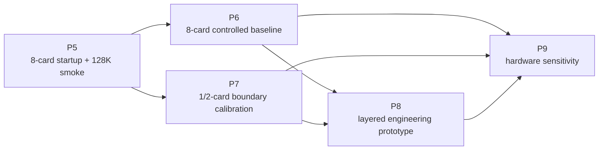

# P5-P9 实验计划

日期：2026-07-16

本文档是 P5-P9 的稳定阶段契约。P8 的工程细节见 `docs/P8_LAYERED_ENGINEERING_PROTOTYPE_PLAN.md`；每轮实时状态、服务器回传和下一动作写入 `工作记录与进度笔记本/`。

## 1. 当前起点

P0-P4 已建立两类可复用资产：

- P0/P3 hardware microbench 与服务器环境/可观测基线。
- P1 Qwen3.5-4B / vLLM 请求、长上下文、Prefix Cache、phase memory、msprof 和 request-device readout 链路。

这些资产能提供工具链、指标 schema 和校准输入，但不是 DeepSeek-V4-Flash 八卡性能结论。

NPU 0-7 已获当前任务明确授权。P6.1R retry2 与 P6.1L-R1 已关闭最小 MTP 和固定 4K 长输出门；
P6.1C-R1 已由开发机接受为 `green_mtp_official_context_ladder`，
`highest_stable_context=131072`，official 功能/容量/稳定性 reference baseline=true。P6.1
unprofiled 随后由开发机接受为 `green_mtp_unprofiled_baseline`，性能 reference baseline=true；
P6.2 也已接受为 `green_mtp_profiled_evidence`，profiled evidence baseline=true。
P6.3A 已接受为 `green_p6_3a_mtp_matched_ab`；原 P6.3B 保留
`yellow_p6_3b_prefix_cache_matched_ab_partial`，P6.3B-R1 保留 ready 前
`red_p6_3b_r1_hybrid_kv_repair_no_success`。P6.3B-R2 已接受为
`green_p6_3b_r2_hybrid_kv_repair`：3/3 prime、9/9 measured、9/9 positive hit，证明 same R2 repair
恢复有界 hybrid-KV+MTP Prefix Cache hit。P6.3B-R3 因 off 侧省略 negative flag 后继承 vLLM 默认 true，
实际为 repaired on-vs-on，保留 yellow。P6.3B-R4 已建立 explicit control，但在新服务器 NFS4
root-squash 挂载上因 `cp -a` 保留 ownership 失败而在 vLLM 启动前 blocked；actual server lifecycle=`0`、
request=`0/64`，不构成 Prefix Cache/hybrid-KV 机制证据。当前 P6.3B-R4-R1 已授权。
当前合同状态为：

```text
task_id:p6_3b_r4_r1_deepseek_v4_flash_w8a8_mtp_explicit_prefix_cache_matched_ab_2026_0716
authorized_for_execution
npu_execution_authorized:true / next_task_authorized:true
P6.3B-R4-R1: ownership-safe archive copy / same R2 repair / explicit no-enable vs enable / live resolved config / token LCP / 8 groups / 64 requests
```

server-local Git 管理最终验收已完成。P8.1 observe-only handoff 继续延后；
`通信模块/docs/developer-to-server.md` 当前已授权 P6.3B-R4-R1。R4-R1 只修复新服务器 root-squash
下的 ownership-preservation portability gate，并继续回补 R3 缺失的 true off control；
candidate green 仍须开发机复核。P6.3C 与 P8 不自动进入。

mixed checkpoint 的最终四卡诊断已在当前 SoC 能力门收口，项目不再实现 adapter 或继续 mixed runtime probe。W8A8-MTP 的 task-local overlay 已先后通过 P6.1R、P6.1L-R1 和 P6.1C-R1；official 131072 context、P6.1 unprofiled 性能门与 P6.2 profiled evidence 门均已关闭。P6.3 和 P8 继续分离，外部开发机不运行 NPU。

## 2. 阶段依赖



允许的并行：

- P5 回传后，P6 baseline stabilization 与 P7 小模型/中型 MoE boundary harness 可以并行准备。
- P8.0 capability probe 和 P8.1 observe-only trace 可以先在 P6/P7 已成功 workload 上开始。

禁止的跳步：

- P5 `red` 时不得直接宣称进入 DeepSeek P6 benchmark。
- 没有 P6 fixed-output baseline 时，不在 DeepSeek 路径上做性能型 P8 A/B。
- 没有 expert trace 时，不进入真实 expert offload/prefetch。
- 没有 trace/microbench 校准时，不输出 P9 硬件优先级。

## 3. 全局实验与证据契约

### 3.1 五类证据

| 类型 | 回答的问题 | 不能回答 |
| --- | --- | --- |
| `readiness` | 路径、版本、设备是否可见 | 模型是否能稳定推理 |
| `smoke` | 模型、runtime、请求路径是否能跑 | 性能优劣和瓶颈 |
| `controlled_benchmark` | 固定条件下的性能和单变量差异 | 未采集机制的因果归因 |
| `profile_readout` | runtime/device/operator 发生了什么 | 无 profiler-overhead 隔离的用户性能 |
| `calibrated_simulation` | 已测范围内的 what-if 区间 | 未校准硬件的确定结论 |

### 3.2 每个实验必须固定

```text
git commit
server/runtime/model object
完整 server command 与环境变量
rank mapping 与 TP/EP/DP/PP
workload manifest
input/output token policy
sampling 与 stop/EOS policy
server lifecycle
unprofiled 或 profiled 标记
已知混杂因素
artifact path 与 70KB 回传摘要
Scope / Not Claim
```

### 3.3 性能与 profiler 分离

- 用户侧 TTFT、TPOT、ITL、E2EL、throughput 以 unprofiled run 为主。
- msprof/profiled run 用于 operator、device task、transfer、memory 和 request-device join。
- 不把两种 run 的 latency 直接拼在同一性能表里。
- 单变量 A/B 只能改变一个目标变量；若启动参数被迫降级，另建 profile，不覆盖原条件。

## 4. P5：DeepSeek-V4-Flash 八卡启动与 128K Smoke

### 4.1 目标与对象

```text
runtime object: /data/node0_disk1/Public/DeepSeek-V4-Flash-w8a8-mtp
runtime:        server host conda
parallelism:    TP=8, EP=enabled
quantization:   ascend
```

W8A8-MTP 是唯一执行对象。NPU 0-7 已为本轮八卡 smoke 独立授权；mixed checkpoint 仅保留历史诊断与来源 inventory。

### 4.2 Smoke 契约

优先尝试：

```text
max_model_len=135168
max_num_seqs=16
prefix cache=on
chunked prefill=on
MTP=on
context ladder=4096,32768,65536,98304,131072
output tokens=fixed 64
```

降级顺序固定为：

```text
max_num_seqs 16 -> 4 -> 1 -> disable MTP
```

### 4.3 状态与下一门

| P5 状态 | 定义 | 下一步 |
| --- | --- | --- |
| `green` | MTP 保持开启，八卡 ready，`131072+64` 成功 | 进入 P6.0 baseline freeze |
| `yellow` | 八卡至少一个请求成功，但发生降级或未达 131072 | 只进入 P6.0 stabilization；修复前不称 official baseline |
| `red` | 八卡不能 ready 或无请求成功 | 留在 P5 remediation；P7 工具链预研可继续 |

### 4.4 当前资源门

- mixed-checkpoint 四卡诊断已结束：46/46 分片加载后在 FP4 expert 后处理命中当前 SoC 不支持错误，不再继续 adapter 或 runtime probe。
- W8A8-MTP 权重为 `279.41 GiB`，超过四卡约 256GiB 聚合 HBM，当前四卡授权不具备 full-model 容量。
- 当前活动任务已固定 `ASCEND_RT_VISIBLE_DEVICES=0,1,2,3,4,5,6,7`；执行前仍必须确认八卡健康空闲，发现冲突时不得清理他人进程，只能标记 `blocked_resource`。
- 路线选择只关闭模型对象决策，不关闭 W8A8 weight-load、server-ready、请求或性能门。
- 当前 W8A8 weight-load、server-ready、MTP `4096+64`、固定 4K 长输出、official `131072+64` context ladder、P6.1 unprofiled 性能基线与 P6.2 profiled evidence 均已关闭；当前缺口为 P6.3 matched single-variable evidence。

P5 不运行 msprof，不做 request-device aggregate，不输出瓶颈或优化收益。

## 5. P6：单机八卡 Controlled Baseline

目标：在 Atlas 800T A2 8×64GB 上建立可复现的 DeepSeek-V4-Flash W8A8-MTP reference point。

### P6.0：Baseline Freeze / Stabilization

- 归档 P5 的最终成功 command、版本、rank mapping 和最高稳定上下文。
- P5 `yellow` 时，先解释降级原因并形成稳定 profile；不得直接升级为 official baseline。
- 冻结一个短上下文 smoke workload、一个中/长上下文 workload 和固定输出策略。

P6.0 当时只稳定 degraded 短上下文 cell：已有 1 次 P5 成功，再执行 2 个独立 fresh server lifecycle，每次只发 1 个相同 `4096+64` 请求。两次皆成功才记为 `yellow_degraded_baseline_stabilized`；这不会自动关闭中/长上下文、MTP 或 official baseline 门。

退出门：相同 command 连续成功，输出控制成立，server lifecycle 和环境无漂移。

当前结果：P6.0 已以 `yellow_degraded_baseline_stabilized` 收口；仍非 official MTP/128K baseline。

### P6.1：Unprofiled Repeatability

修复前最小对照已完成：固定 no-MTP degraded cell，一个 server lifecycle，1 次 warmup 后串行 3 次 measured `4K+64+c1`。warmup 不进入统计；3 个样本只报原始值和 min/median/max，不报 P95/P99、不删除 outlier。

以下三个 tracer-bullet 与完整矩阵已完成：

先跑三个 tracer-bullet cell：

```yaml
pilot_cells:
  - {context: 4096, output_tokens: 64, concurrency: 1}
  - {context: 65536, output_tokens: 64, concurrency: 4}
  - {context: 131072, output_tokens: 64, concurrency: 1}
repeats_per_pilot_cell: 3
```

三个 pilot 稳定后已自动扩展 `context=[4096,65536,131072]`、`output_tokens=[64,256]`、`concurrency=[1,4,8]`；pilot cell 复用三批数据，其余 15 cell 各跑一批，零 retry。最终 18/18 cells、24/24 measured batches、90/90 measured requests 首次成功，开发机接受为 `green_mtp_unprofiled_baseline`。

输出：TTFT、TPOT、ITL、E2EL、throughput、success/token control 和 server stats。ITL 报 P50/P95/P99；小样本 request 指标保留原始值与 `n`，不伪造稳健尾分位。

### P6.1R：Bounded MTP Reference Repair

P6.1R 是 P6.1 与既有 P6.2 profiled evidence 之间的 repair gate，不占用原 P6.2 阶段编号。该 gate 当时只允许：

1. 首次 attempt 因不存在的历史证据路径在 overlay 前 `blocked_repo`；retry1 修正路径后以同一单行 overlay 跨过原 `positions_cpu` graph-capture 首错并使服务 ready，但唯一请求因 completion payload/chat endpoint 错配而 HTTP 400。
2. retry2 继续只读证明同一根因和精确 source/patch/payload hash，沿用同一单字段 patch，不开发第二个 plugin patch。
3. overlay gate 只要求 package root 来自 overlay、patched overlay hash 和 unchanged base hash；不直接 import 已知会触发 circular import 的 proposer module。
4. 唯一请求发往 `/v1/completions`；HTTPError body 最多留 8192 bytes，首错优先 request error，不把停机期 TBE 噪声当作 request 首错。
5. 最多启动一个 MTP lifecycle，并最多发送一个 `4096+64+c1` 请求；原错消失但出现新首错时立即停止，不得补发、eager fallback、完整上游 backport 或调参。

green 只表示最小 MTP `4096+64` 功能门关闭；official reference baseline 仍要求后续单独授权的 `131072+64` context ladder。

### P6.1C-R1：MTP Official Context Ladder HBM Sampling Repair

parent P6.1C 已定级 `blocked_sampling_calibration`：`npu-smi info -t usages` 在服务器
26.0.rc1 上只返回缺少 card ID 的帮助文本，36 次 sweep 全部解析失败；两份 `65536+64`
请求由服务器摘要报告成功，但 calibration 不计入 official context，且 official lifecycle
没有启动。P6.1C-R1 随后完整重跑并由开发机接受为 `green_mtp_official_context_ladder`。

R1 最多使用两个 lifecycle。启动模型前先执行三次单 subprocess 的 `npu-smi info`，从同一
八卡表格解析 `HBM-Usage(MB)`，要求三次均 return code 0、8/8 coverage、capacity=65536MB。
calibration 再用三份 token multiset 相同、pairwise common-prefix 为 0 的 `65536+64` 请求
比较无采样 control、0.5 秒 requested-minimum-start high-resolution trace 和
selected-interval validation。在 `0.5/1/2/5s` 中选择满足八卡覆盖、峰值误差不超过 1 个
百分点、reference 每卡至少 4 样本且 selected 每卡至少 2 样本的最大周期。sweep wall
duty-cycle 只记录 p50/p95/ratio，不作 hard gate；validation 相对 control 的 request-wall
增幅不超过 10% 才是推理干扰硬门。

calibration green 并 cleanup 后，第二个 fresh lifecycle 无 warmup、并发 1、顺序执行
`4096/32768/65536/98304/131072 + 64`。每档 canonical body 在 server 启动前冻结；每档
最多一次同 body retry，禁止 restart、调参、第二 patch、关闭 MTP、降低 context、修改
`max_num_seqs` 或 eager fallback。只有五档全部首次成功且 token、speculative counters、
health/queue、HBM、resource 与 cleanup hard gates 全通过，服务器才可给出 candidate green；
开发机复核经用户批准的小结果包后才可接受 official green。calibration wall time 不是性能
证据。P6.1 unprofiled 已另起并获授权；profiler 和 P8 仍另起任务。

### P6.2：Profiled Evidence

从 P6.1 选择三个代表性 cell 单独运行 msprof、phase-memory sampler 和 request-device aggregate：

- `short_prefill=4096+64+c1`。
- `long_prefill=131072+64+c1`。
- `decode_heavy=4096+256+c1`。

输出 operator/device/transfer/memory 读数及 join coverage，不把 profiler 下用户 latency 当 P6.1 性能。

当前结果：三个 cell 均首次成功；每 cell `profiler_exit=0`、136 个 SQLite 文件，full
request-device aggregate exit=0 且未使用 skip-heavy-joins fallback；phase-memory 共 6 行、
八卡覆盖完整、parse failure=0。开发机接受为 `green_mtp_profiled_evidence`。

### P6.3：单变量 A/B

复审后的顺序：

1. P6.3A matched MTP on/off。
2. P6.3B purpose-built repeated-prefix Prefix Cache on/off。
3. P6.3C Chunked Prefill on/off，仅在严格单变量成立时执行。
4. P6.3D 可选 `max_num_seqs` scheduler/capacity sweep。

`max_model_len` 移入 P7 capacity boundary，不再是 P6.3 必做性能 A/B。每组必须使用相同请求集、
固定输出、相同 warmup、等价 lifecycle 和相同非目标开关。性能 A/B 以 unprofiled run 为主；
差异成立后才另起 profiled 跟进。

P6.3A 已接受为 `green_p6_3a_mtp_matched_ab`：固定 `mtp_off -> mtp_on` 两个 fresh lifecycle，采用
`4096+64+c1`、`4096+256+c1/c8`、`65536+64+c1/c4`、`65536+256+c1`、
`131072+64+c1`、`131072+256+c1` 八个 matched cell，每 mode 每 cell 3 个 batch，合计
48 measured batch / 108 measured request。55 份 canonical body 只生成一次并跨 mode 复用；
唯一 server 自变量是是否存在 MTP speculative config。固定 mode 顺序作为限制报告，green
表示 matched evidence 完整；开发机复核确认 24/24 paired batches 方向一致，但不扩写为随机化因果或统计显著。

P6.3B matched 合同已完成为 `yellow_p6_3b_prefix_cache_matched_ab_partial`：64/64 请求完成，
但 Prefix-on 24/24 measured follower hit 为 0；R1 保留 ready 前 red。R2 已接受为
`green_p6_3b_r2_hybrid_kv_repair`，same R2 repair 在 32K/64K/128K 的 9/9 measured follower 恢复
positive hit。当前 R3 在 off/on 两侧加载同一 repair，完整复跑原 8 组 matched A/B，只改变
`--enable-prefix-caching`；R3 candidate green 仍不自动等于 Prefix Cache 普遍加速。

### P6.4：MindIE 对照（条件项）

MindIE 当前服务器证据为缺失/unknown，不是 P6 阻塞项。只有单独确认 runtime availability、版本、模型支持和配置后，才建立 MindIE 同 workload 对照卡。MindIE 与 vLLM-Ascend 的指标必须先做语义映射，不能直接把不同 client/runtime 字段拼成等价 A/B。

### P6 交付物

```text
p6_baseline_contract.yaml
p6_unprofiled_baseline_report.md
p6_profiled_evidence_report.md
p6_single_variable_ab_report.md
p6_artifact_manifest.yaml
```

## 6. P7：单卡/双卡极致硬件边界

目标：在 64GB/128GB 近端容量下建立失败边界和 P8/P9 校准点，不承诺 full DeepSeek-V4-Flash official deployment。

### 6.1 四条实验线

| 线 | 对象 | 主要问题 | 输出 |
| --- | --- | --- | --- |
| B0 | 小模型 | KV/Prefix、transfer、trace 工具链是否能在 1/2 卡复现 | adapter/trace smoke |
| B1 | 中型 MoE | expert trace、hotset、placement、miss curve 是否可见 | expert calibration trace |
| B2 | DeepSeek 子图/partial shard/source metadata | 格式、kernel、scale、KV shape、局部容量卡在哪里 | compatibility/boundary matrix |
| B3 | 模拟 expert pool/full-model simulator | 容量与迁移策略的上/下界 | calibrated what-if input |

### 6.2 失败分类

```text
capacity
weight_format_or_scale
kernel_or_operator
runtime_or_scheduler
collective_or_rank_mapping
state_restore_or_transfer
unsupported_feature_combination
```

失败实验必须保留最小复现命令、第一失败点、峰值内存/设备状态和 artifact path。

### P7 交付物

```text
p7_single_dual_card_boundary_report.md
p7_format_kernel_compatibility_matrix.yaml
p7_expert_pool_calibration.parquet
p7_capacity_model.yaml
```

## 7. P8：分层工程原型

P8 采用八个门控垂直切片：

1. P8.0 baseline freeze 与 runtime capability probe。
2. P8.1 observe-only StateObject/StateEvent trace。
3. P8.2 KV/Prefix 真实 DRAM warm-tier 路径。
4. P8.3 expert weight inventory、TP4 rank mapping、trace、hotness 与 static placement。
5. P8.4 Expert Tier V0 模拟分层与 TP4 expert-residency capacity model。
6. P8.5A 证据门通过后的独立 expert payload mover / DRAM→HBM warm prefetch。
7. P8.5B CPU-first loader + TP4 W8A8 full-model expert-residency capacity prototype。
8. P8.6 打包 P9 trace bundle。

完整架构、对象契约、执行模式、门槛、指标和交付物见：

```text
docs/P8_LAYERED_ENGINEERING_PROTOTYPE_PLAN.md
```

核心边界：

- vLLM-Ascend 是当前可执行主路；MindIE 是 availability-gated 对照路。
- `StateObject` 管理元数据和策略，不接管 tensor payload 或另写推理引擎。
- EPLB/static expert map 不等于 expert offload。
- 当前 TP8 权重/HBM 证据否定直接改 `TP=4`，但不提供固定卸载 GB 数；会话中的 `150–170GB` 只能作为待校准假设。
- Expert V0 先用逐 tensor/expert inventory、TP4 owner mapping、runtime reserve 与 holdout trace 建模；真实 warm prefetch 必须通过 trace、bytes、load latency 和 lead-time 门。
- TP4 首个目标只是 `4096+64,c1` capacity/path smoke。必须在完整 TP4 HBM allocation 前由独立 CPU-first loader 建立 HBM/DRAM residency；成功 smoke 或实测不可行报告都能关闭研究问题，缺测不能关闭。
- SSD/NVMe 只做 cold persistence/离线恢复，不进入逐 token decode 热路径。
- P8.0 的旧 `frozen_degraded` contract 保留首个 no-MTP runtime cell 作为历史 provenance；official MTP、unprofiled 与 profiled P6 reference 已就绪。P8.1 本地 collector/adapter 已准备，但服务器验证尚未下发；进入前先确认 P6.3 计划并新建或提升 baseline contract。它仍只允许 bounded observation JSONL 到 StateEvent/StateObject/no-op decision 的反腐层，不读取或持有 tensor payload。

## 8. P9：Trace-driven Hardware Sensitivity

目标：把 P0/P3 microbench、P6 baseline、P7 boundary 和 P8 state trace 转成带证据等级的下一代硬件优先级。

### 8.1 输入

```text
真实 workload/request distribution
KV bytes/token 与 prefix reuse distribution
expert size/hotness/reuse/miss penalty
HBM/DRAM occupancy and bandwidth calibration
H2D/D2H and collective measurements
SSD I/O size/QD/P95/P99
CPU scheduling/I/O/prefetch cost
runtime capability and software assumptions
```

### 8.2 方法

- 用训练窗口拟合成本模型，用 holdout workload 校验误差。
- 每个 what-if 值都保留 measured/derived/simulated provenance。
- 扫描单参数后再扫描少量交互项，避免无约束组合爆炸。
- 将软件前提、硬件参数和 workload 前提同时写入建议。

### 8.3 输出

```text
hardware_sensitivity_report.md
hardware_ask_matrix.yaml
bottleneck_attribution_report.md
simulator_validation_report.md
```

每条硬件建议必须绑定：触发实验、观测机制、受影响指标、模型误差、软件前提、适用 workload 和置信度。

## 9. 当前执行顺序

1. P6.0 已固结 `yellow_degraded_baseline_stabilized`，P6.1 minimal control 已固结 `yellow_degraded_minimal_unprofiled_control_measured`；两者都不重跑。
2. P6.1R retry2 与 P6.1L-R1 已完成并验收，不原样重跑。
3. P6.1C-R1 已完成并验收为 official green，不重跑。
4. P6.1 unprofiled 已完成并验收为 `green_mtp_unprofiled_baseline`，不重跑。
5. P6.2 profiled evidence、P6.3A matched MTP A/B 与 P6.3B-R2 repair 已验收；原 P6.3B yellow、R1 red、R3 on-vs-on yellow 与 R4 root-squash blocked 保留，当前 P6.3B-R4-R1 已授权，P6.3C 与 P8.1 不自动进入。
6. P7 工具链预研可继续，但不得外推 full-model runtime。
7. P9 最后消费统一 trace bundle，输出硬件优先级。

当前 P6.3B-R4-R1 双授权均为 true；执行并完成开发机复核后，再按
`工作记录与进度笔记本/16_P6_阶段复盘与P6_3进入评估.md` 判断条件式 P6.3C。
