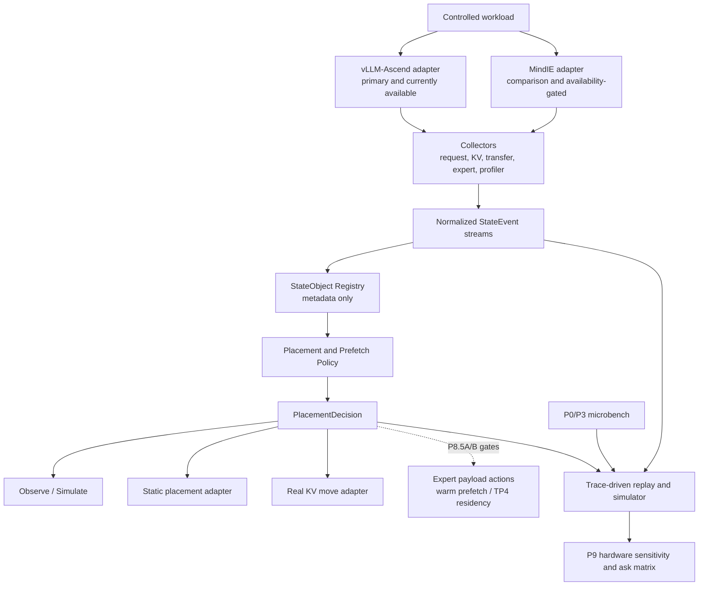

# P8 分层工程原型实施计划

日期：2026-07-10；最后更新：2026-07-16

状态：`implementation_in_progress / source_probe_v0221_complete / official_p6_reference_ready / observe_only_adapter_implemented_server_validation_pending / tp4_expert_residency_goal_defined`

状态拆分：`local_artifact_state=observe_only_implemented`；`server_execution_state=p8_not_authorized`；`real_move_state=closed_by_gate`；`tp4_state=plan_defined_measurements_missing`。本地已有代码不代表服务器已授权执行 P8，更不代表 real move 已打开。

## 1. P8 的工程定义

P8 不以“找到一个现成框架并完成完整集成”为目标。当前没有证据表明存在一个可直接在本项目 Atlas 800T A2 / Ascend NPU 环境中同时完成 KV/Prefix 管理、MoE 专家热温冷分层、卸载、预取和硬件规格反推的生产级框架。

P8 的目标是建立一个**分层工程原型**：

> 以 vLLM-Ascend 为当前主运行底座，以 MindIE 为受 runtime availability 门控的对照底座；先复用可验证的 Prefix Cache、KV Cache CPU Offload、UCM / External KV Cache、EPLB 等能力，再自研一个不接管推理引擎的 `StateObject` 控制面，把 KV、Prefix、Expert、WeightShard、Session 的元数据、生命周期、位置、成本和策略统一起来；MoE 先完成 trace、hotness、static placement 和模拟分层，只有证据门通过后才进入真实 DRAM→HBM warm prefetch；最后把真实 trace、microbench 和策略事件交给 trace-driven simulator，由 P9 扫描硬件参数。

P8 还必须关闭一个明确的容量问题：当前 W8A8 不能只把 `TP=8` 改成 `TP=4` 后直接运行；MoE Expert Offload / Expert Cache 能否让 4×64GB 形成 full-model capacity smoke，当前只是待验证假设。P8 的有效终局可以是四卡 `path_smoke` 成功，也可以是逐 tensor/expert 容量、TP4 rank mapping、kernel 或迁移 deadline 证据证明当前组合不可行；不能只完成模拟后把四卡问题留空。

这里的 `StateObject`、热层/温层/冷层是项目内抽象，不是外部标准术语。对外术语仍使用 KV Cache CPU Offload、External KV Cache、Prefix Cache、MoE Expert Offload / Expert Cache、HBM / DRAM / SSD-NVMe tier 等。

## 2. 当前事实与能力边界

### 2.1 当前服务器事实

| 项目 | 当前证据 | P8 解释 |
| --- | --- | --- |
| vLLM-Ascend | `0.22.1/0.22.1rc1` 独立栈的 installed-content 6/6、五插件路由、memory redirects / `MemorySnapshot` 与 CANN ACL parent/spawn 路径均已通过；W8A8-MTP 已完成 official 131072 context、unprofiled performance 与三个代表性 profiled evidence cell | P8 已有可信 reference point；observe-only server validation 仍需新 baseline contract 和独立授权，不解锁 payload move 或性能结论 |
| MindIE | 同一轮体检为 `mindie_version=unknown`，P1 package inventory 记录 `mindie=missing` | 不能写成当前可执行底座；需单独关闭 availability gate |
| DeepSeek-V4-Flash | W8A8-MTP 是项目主对象；P6.1C-R1、P6.1 与 P6.2 已建立三层 reference；mixed checkpoint 因 910B1 MXFP4 SoC 门退出执行 | P8 不绕过 P6.3 机制对照修改模型路径，也不实现 mixed checkpoint adapter |
| TP4 容量证据 | checkpoint 为 `300013759966 B ≈ 279.41 GiB`；TP8 no-MTP/MTP 权重加载日志分别为 `38.1255/39.2795 GB per worker`；P6.1C whole-device HBM 峰值为 `61436–61447 MB / 65536 MB` | 足以否定“原命令直接 TP8→TP4”作为参数调整，但不能据此固定需要卸载多少 GB；先做 expert inventory、TP4 mapping 和 runtime reserve 校准 |
| KV/Prefix object trace | 当前有 server stats proxy、phase memory、H2D/D2H microbench 和统一事件契约 | 尚无 object bytes、真实 hit/miss、restore/recompute 闭环 |
| Expert trace | 当前无 DeepSeek-V4-Flash router top-k / per-expert trace 闭环 | P8.3 必须先观测，再谈分层 |
| SSD cold tier | 已有 fio envelope | 只能校准冷层；不能证明逐 token restore 可用 |

### 2.2 后续自研的目标开发基线

```text
vLLM             0.22.1        tag v0.22.1@0decac0
vLLM-Ascend      0.22.1rc1     tag v0.22.1rc1@5f6faa0
CANN              9.0.0
PyTorch           2.10.0
torch-npu         2.10.0
triton-ascend     3.2.1
```

`reference_repos/vllm/` 与 `reference_repos/vllm-ascend/` 继续跟踪最新 `main`，上述两个标签已取回到各自 shallow 仓库，不再保留并行的 `vllm-ascend-v0.18.0/` 目录。后续一方修改应在 `reference_repos/` 之外从两个标签 commit 创建开发分支；不直接在被忽略的第三方参考树中积累项目代码。

这套版本已在服务器构建并完成 installed-content、五插件、fresh-process memory 和 CANN ACL 路径验证。mixed FP8+FP4 checkpoint 已加载 46/46 分片，但在 910B1 命中不支持所需 `customize_dtype` 的 SoC 门，因此退出执行；W8A8-MTP 后续通过 task-local overlay 完成 official 131072 context、18-cell unprofiled performance、三个代表性 profiled evidence cell、P6.3A matched MTP on/off 与 P6.3B-R4-R1 explicit Prefix Cache control。P6.3C 已因 `4096 < 135168` 收口为 `blocked_p6_3c_not_strict_single_variable`，P8 server validation 仍未授权。

### 2.3 框架能力只先登记为候选

截至 2026-07-12，vLLM-Ascend 官方资料和固定 tag 源码包含 KV Cache CPU Offload、UCM Store、KV Cache Pool、EPLB 和 Weight Prefetch 等入口；MindIE 2.3 官方资料包含 Prefix Cache、KV Cache 池化、专家热点采集和冗余专家部署等机制。但是：

- 最新 `main` 文档不等于固定 `vLLM-Ascend 0.22.1rc1` 标签或服务器环境已包含同一接口。
- `deepseek_v4_fp8` 源码注册不等于官方 mixed checkpoint、当前 CANN 和本项目 workload 已运行成功。
- MindIE 官方能力存在不等于当前服务器已安装 MindIE，也不授权本轮安装或升级。
- vLLM-Ascend Weight Prefetch 是设备侧权重/L2 预取优化入口，不等于 CPU/SSD 专家卸载框架。
- EPLB 是专家负载均衡、复制和放置支点，不等于完整的专家热温冷卸载和回温系统。

因此 P8.0 必须先生成 `runtime_capability_matrix.yaml`，每项只能取以下状态之一：

```text
unsupported
documented_unverified
available_uninstrumented
instrumented
validated_for_selected_workload
```

任何 `documented_unverified` 项都不能进入性能收益结论。

2026-07-10 已完成目标 tag 的只读 source probe：固定检查 vLLM
`v0.20.2@bc150f5` 与 vLLM-Ascend `v0.20.2rc1@367b8e6`，13 项能力中
7 项为 `available_uninstrumented`、6 项为 `instrumented`，没有
`unsupported`、`documented_unverified` 或 `validated_for_selected_workload`。
这里的 `instrumented` 只表示目标源码同时存在实现入口和可导出事件/指标符号，
不是服务器路径已经运行；完整证据见
`benchmarks/deepseek_v4_flash/p8/runtime_capability_matrix.yaml` 和
`p8_0_source_capability_probe_report.md`。这些 versioned source 产物保留生成时的
`waiting_selected_workload_runtime_gate` 历史口径，不在 runtime 成功后重写。

这份 13 项矩阵是 `0.20.2/0.20.2rc1` 的历史目标-tag快照。2026-07-12
已在 `source_probes/vllm-v0.22.1__vllm-ascend-v0.22.1rc1/` 新增版本化
source spec、matrix 和报告，没有覆盖历史产物。新矩阵仍为 7 项
`available_uninstrumented`、6 项 `instrumented`，全部声明的 blob evidence 命中，
但 `validated_for_selected_workload=0`。

服务器已证明 installed-content、完整五插件、worker/fresh-process `MemorySnapshot`
和 CANN ACL parent/spawn 环境继承规则，并完成首个 W8A8 no-MTP `4096+64`
请求。`p8_baseline_contract.yaml` 已冻结该 exact degraded cell；真实
`VllmAscendAdapter` 已按 bounded JSONL 反腐层实现，但服务器 trace bundle
验证仍待执行。MTP、128K 与 P6 reference 门已关闭；P6.3A 与 P6.3B-R4-R1 已完成，P6.3C 严格单变量可行性已 blocked 且没有执行 workload，P8 server validation 和所有
real-move gate 仍保持关闭。

### 2.4 TP4 容量数字的使用边界

当前三类数字不能直接相减或线性外推成四卡验收值：

- checkpoint 文件总量包含完整模型对象，但不等于某个 TP/EP rank 的 materialized HBM tensor bytes；
- `Loading model weights took ... GB` 是 runtime 的 per-worker 加载报告，TP8 数值乘二只能作为 TP4 压力下界提示，不是 TP4 实测；
- P6.1C 的 `61436–61447 MB` 是 whole-device occupancy，包含 runtime reserve、KV pool、graph/workspace、通信缓冲和 allocator 行为，不是 expert payload bytes。

因此不把“需卸载 150–170GB”写成固定目标。P8.3 必须先形成逐 tensor/expert inventory，P8.4 再用实际 TP4 owner mapping、HBM safety reserve、pinned DRAM staging 和 allocator headroom 计算可行区间。任何容量值都必须标出单位、measurement scope、MTP/Prefix 配置和 provenance。

## 3. 总体架构



职责边界：

- 推理引擎负责模型执行、scheduler、cache manager、expert dispatch 和真实 tensor payload。
- Runtime Adapter 只做能力探测、配置翻译、hook 接入和受控动作，不另写一个推理引擎。
- `StateObject Registry` 管理元数据和证据引用，不复制或持有模型权重/KV payload。
- Policy 只输出 `PlacementDecision`；是否能执行由 adapter capability 决定。
- Simulator 可以消费未执行的决策做 what-if，但模拟结果必须和真实实验结果分层标记。

## 4. 统一对象与事件契约

### 4.1 StateObject

`StateObject` 是项目内部控制面对象，只描述“是什么、在哪里、何时会再用、移动/重算代价是多少”。最小字段：

```yaml
schema_name: ak_state_object
schema_version: 0.2.0

object_id: string
object_type: kv_block | prefix_block | expert_weight | weight_shard | session
model_id: string
layer_id: int | null
expert_id: int | null
owner_request_id: string | null
session_id: string | null
scope: request | session | model | global

payload_ref: opaque_runtime_reference | null
bytes: int | null
precision: string | null
layout: string | null
checksum_or_version: string | null

current_tier: hbm | dram | pinned_dram | ssd | remote | unknown
current_rank: int | null
target_tier: hbm | dram | pinned_dram | ssd | remote | none

hotness_score: float | null
reuse_distance: int | null
next_use_estimate_ms: float | null

load_cost_ms: float | null
evict_cost_ms: float | null
recompute_cost_ms: float | null
prefetch_lead_time_ms: float | null

hit_count: int
miss_count: int
last_access_ts_ns: int | null
evidence_source: runtime_event | server_stats | profiler | derived | simulated
quality_risk: none | low | medium | high
```

设计约束：

- `Trace` 不是 `object_type`。Trace 是描述对象生命周期和策略决策的事件流。
- `WeightShard` 与 `Expert` 分开：前者描述 checkpoint/runtime shard，后者描述有路由语义的 expert weight。
- 未知真实字节数时写 `null`，不能用 whole-device HBM 或 tensor footprint 代替。
- `payload_ref` 必须是 runtime 内部不透明引用；控制面不得私自复制 tensor。

### 4.2 StateEvent

在现有 `工作记录与进度笔记本/p1_inference_contracts/state_object_event_schema.yaml` 基础上规划 0.2.0 扩展：

```yaml
event_type: request_stage | state_lifecycle | transfer | expert_route | policy_decision
timestamp_ns: int
trace_id: string
request_id: string | null
session_id: string | null
object_id: string | null
runtime: vllm_ascend | mindie | simulator
rank_id: int | null
phase: prefill | decode | idle | unknown
action: string
source_tier: string | null
target_tier: string | null
bytes: int | null
latency_ms: float | null
reason: string
evidence_source: string
```

### 4.3 PlacementDecision

```yaml
decision_id: string
object_id: string
policy_name: string
policy_version: string
action: keep | prefetch | offload | restore | evict | recompute | no_op
source_tier: string
target_tier: string
issued_ts_ns: int
deadline_ts_ns: int | null
expected_benefit_ms: float | null
expected_cost_ms: float | null
confidence: float | null
execution_mode: observe_only | simulate_only | static_placement | real_move
executed: bool
execution_result: success | failed | skipped | unsupported
```

所有策略必须同时记录“不动作”决策，避免只保留成功预取造成选择偏差。

## 5. Runtime Adapter 边界

### 5.1 vLLM-Ascend Adapter

优先级：

1. 使用已有 server stats、KV events、公开 connector/config 和 EPLB 日志/导出。
2. 通过稳定 hook 或 wrapper 补齐事件。
3. 只有前两种无法提供最低 trace 粒度时，才提出小范围 runtime patch；patch 必须单独建实验分支和对照，不直接混入 baseline。

首批能力探测：

```text
prefix_cache
kv_cache_events
OffloadingConnector + NPUOffloadingSpec
UCMConnector / UCM config
EPLB recording + static expert map
expert hotness metrics
weight prefetch
```

### 5.2 MindIE Adapter

MindIE 不是当前 P8 的阻塞项。只有同时满足以下条件才进入实测对照：

- 服务器已有经用户确认的 MindIE 安装或独立可复现环境。
- 版本、模型支持矩阵、配置和许可证/使用边界已记录。
- 不破坏当前 vLLM-Ascend host conda 基线。
- 能输出与 vLLM-Ascend 对齐的 request、Prefix/KV、expert hotness、memory 和 latency 字段。

否则仅保留官方能力对照表，不安排安装任务，不把 MindIE 数字和 vLLM 数字直接拼成 A/B。

## 6. P8 分阶段垂直切片

### P8.0：Baseline Freeze 与 Capability Probe

目标：冻结可比较基线，确认“哪些能力在当前版本真实存在”。

输入门：

- source capability probe 可在运行门之前完成，但结论上限为 `instrumented`。
- 冻结真实 baseline 和启动 observe-only adapter 前，P5/P6 必须在八卡 W8A8-MTP 路径至少有一个请求成功，并记录 MTP、context 与 evidence boundary；该门已由 P6.1C-R1、P6.1 和 P6.2 超额关闭。
- P8.2 性能对照前，P6 的 unprofiled workload 与 profiled workload 必须分离；该门已关闭。P6.3B-R4-R1 已提供 primary-scope explicit Prefix Cache mechanism evidence，但 K0 仍须另建 order-balanced/randomized P8.2 合同，不能复用固定顺序 P6.3B 直接宣称性能收益。

交付物：

```text
benchmarks/deepseek_v4_flash/p8/source_probes/<runtime-tags>/source_capability_probe.yaml
benchmarks/deepseek_v4_flash/p8/source_probes/<runtime-tags>/runtime_capability_matrix.yaml
benchmarks/deepseek_v4_flash/p8/source_probes/<runtime-tags>/source_capability_probe_report.md
benchmarks/deepseek_v4_flash/p8/p8_baseline_contract.yaml
```

退出门：选中的 P8.1/P8.2 路径不能仍是 `documented_unverified`。

当前 0.22 source pre-gate、四项启动前置证据门、official MTP/unprofiled/profiled P6 reference 与
P6 五份汇总交付物均已关闭。原 `p8_baseline_contract.yaml` 继续以 `frozen_degraded` 保存最早成功的
no-MTP `4096+64` provenance；新建的 `p8_official_mtp_baseline_contract.yaml` 只将已验收 P6.1
`4096+64+c1` 提升为 P8.1 observe-only 基线，未覆盖历史。当前已准备独立 workload
`p8_1_vllm_ascend_official_mtp_observe_only_adapter_smoke.yaml`；13 项 source capability 仍不能整体提升为
`validated_for_selected_workload`，只有本轮实际观测到的 selected-cell 字段可在开发机复核后升级。

### P8.1：Observe-only StateObject Trace

目标：在不改变 placement 和 payload 的前提下，生成统一对象和事件流。

首个 tracer bullet：

```text
1 个已冻结的 official MTP P6 reference cell（从 P6.1/P6.2 代表 shape 中选择）
1 个 vLLM-Ascend runtime
request_stage + KV/prefix proxy + transfer + policy no_op
trace_validation_errors = 0
```

随后才扩展：

- KV block / prefix block lifecycle。
- session 与 shared-prefix 关系。
- request↔runtime↔device↔object join。
- expert aggregated hotness，再到可行时的 request/router 粒度。

验收：

- 每个成功请求都有 request start/end 与 prefill/decode 边界或明确的 `unknown` 原因。
- 每个 transfer event 都有 direction、bytes 或 `bytes=null + reason`。
- 每个策略决策都有 `execution_mode=observe_only` 和 `executed=false`。
- `trace_validation_errors=0`；未知字段进入 availability report，不用猜测值填充。

### P8.2：KV / Prefix 真实路径

目标：先证明 DRAM warm tier 路径可运行和可观测，再判断是否收益为正。

执行顺序：

| 子阶段 | 路径 | 目的 | 不输出 |
| --- | --- | --- | --- |
| K0 | Prefix Cache on/off baseline | 复用 P6 固定输出对照 | 不外推为 offload 收益 |
| K1 | KV Cache CPU Offload | 验证 HBM↔DRAM move、LRU、restore | 不默认 async overlap 成立 |
| K2 | UCM / External KV Cache，DRAM-first | 验证 external prefix/KV object、hit/miss | 不默认持久化后端更快 |
| K3 | SSD/NFS/3FS cold persistence | 验证重启恢复和冷层容量 | 不进入逐 token decode 热路径 |
| K4 | MindIE Prefix/KV Pool 对照 | 仅在 MindIE availability gate 关闭后执行 | 不跨 runtime 做不受控速度比较 |

首轮矩阵采用逐步放大，不一次做全排列：

```yaml
pilot:
  context: one_mid_context_that_passed_p6
  output_tokens: 64
  concurrency: 1
  prefix_pattern: exact_reuse

expand_after_pilot:
  context: [4K, mid_successful_context, highest_stable_context]
  output_tokens: [64, 256]
  concurrency: [1, 4, 8]
  prefix_pattern: [no_reuse, exact_reuse, partial_reuse]
  num_cpu_blocks: [500, 1000, 2000, 4000]
  block_size: [64, 128, 256]
```

实际矩阵只保留通过 host-memory 预算与 capability probe 的组合。

必采字段：

```text
NPU/CPU block count
object bytes or explicit unknown
NPU hit / CPU hit / external hit / miss
D2H/H2D bytes and latency
restore latency
recompute latency
copy stream and overlap evidence
HBM used/free and host DRAM
TTFT / TPOT / ITL / E2EL / P95/P99
fixed generated-token check
host OOM / timeout / eviction reason
```

P8.2 成功不等于性能提升。负收益但证据完整也是有效结论。

### P8.3：MoE Weight Inventory、Trace、Hotness 与 Static Placement

目标：先把非专家主干、shared expert、routed expert、MTP draft 和量化 metadata 的实际字节与 rank ownership 盘清，再测专家访问分布、负载不均和复用距离，最后做可复现的静态放置/复制。

粒度分两级：

- Level A：EPLB 或 runtime 暴露的 per-layer/per-expert 聚合热度、expert map、负载和更新时间。
- Level B：request/session/layer/token 级 router top-k 与 score。只有 Level A 不足以回答策略问题时才增加 hook。

执行顺序：

1. 对冻结 checkpoint 与 runtime materialization 生成 `expert_weight_inventory.parquet`：至少记录 tensor role、layer/expert ID、checkpoint bytes、materialized bytes 或明确 unknown、precision/layout/scale、TP8 owner 和候选 TP4 owner。
2. 生成 `tp4_rank_weight_budget.yaml`，分别列出 non-expert、shared expert、routed expert、MTP、quant metadata 与未归类 bytes；总量和 rank mapping 必须可回查。
3. 在中型 MoE 或 P6 可运行的 DeepSeek 路径上采集 Level A。
4. 生成 `expert_hotness_summary.parquet` 和 `expert_map_baseline.json`。
5. 计算 frequency、peak-to-average、reuse distance、top-N coverage 和 rank imbalance。
6. 使用 EPLB recording/static map 或等价 runtime 能力做 static placement/replication A/B。
7. 若仍需要预测粒度，再提出 Level B 最小 hook，不直接修改 expert load 路径。

边界：

- EPLB 结果只能证明 placement/load-balance 机制，不等于 expert offload。
- 未观测 expert bytes、load latency 和 miss penalty 时，不计算真实 warm/cold 收益。
- static map A/B 必须固定 workload、输出长度、rank mapping 和 server lifecycle。
- `materialized_bytes` 未实测时必须为 `null + reason`；不得用 checkpoint file bytes 或 whole-device HBM 代填。

### P8.4：Expert Tier V0（模拟分层）

目标：权重仍按 runtime 原路径驻留，只对“如果移动”做 trace replay 和成本建模。

V0 policy：

```text
Hot: 在给定 HBM budget 下，使 holdout trace weighted hit 最大的 expert set。
Warm: DRAM 中的候选 expert metadata / payload-size model，使用实测 H2D cost。
Cold: SSD/NVMe checkpoint 或低频 pool，只使用实测大块 I/O 成本。
```

至少比较：

```text
static_frequency
exponential_moving_average
session_aware
layer_budgeted
oracle_upper_bound
```

训练窗口与评估窗口必须分开；oracle 只作为上界，不能作为可部署策略。

交付物：

```text
expert_tier_v0_policy.yaml
expert_tier_v0_replay.parquet
expert_tier_v0_simulation_report.md
expert_miss_penalty_curve.tsv
tp4_expert_residency_capacity_model.yaml
```

`tp4_expert_residency_capacity_model.yaml` 必须显式预算：non-expert/shared 常驻、hot expert cache、双 staging buffer、KV pool、graph/workspace/collective、allocator fragmentation safety 和 host pinned DRAM。它分别记录 `capacity_gate`、`transfer_gate`、`kernel_format_gate`、`collective_gate` 与 `measurement_completeness`，总状态只能是 `feasible_for_capacity_prototype`、`infeasible_capacity`、`infeasible_transfer_deadline`、`infeasible_kernel_format`、`infeasible_collective` 或 `blocked_missing_measurement`；oracle hotset 不能单独把结果判为 feasible。

### P8.5A：Expert Payload Mover / Warm Prefetch V1（条件式真实原型）

只有同时满足以下门槛才启动：

- P8.3 有稳定 expert identity、hotness 和 placement trace。
- expert payload bytes 与 DRAM→HBM load latency 已实测或能由同形状 tensor microbench 校准。
- holdout trace 中 `prefetch_lead_time_p95` 大于 `load_latency_p95 + safety_margin`。
- wrong-prefetch bytes、HBM staging budget 和 eviction churn 有上限。
- runtime adapter 能在不破坏 baseline 的独立实验路径执行 move。

这些阈值不在计划阶段猜数字。P8.5A 实验卡必须冻结 measurement window、sample count、`load_latency_p95`、`prefetch_lead_time_p95`、`safety_margin` 的计算方式、wrong-prefetch bytes 上限、每 request/token eviction churn 上限、fallback timeout 和失败恢复条件；任一字段缺失时 gate 保持未关闭。

V1 只做：

```text
DRAM warm staging -> HBM prefetch -> execute -> bounded eviction
```

首个真实 slice 先证明同步 load/execute/evict 的 correctness 与 event join，再增加 async prefetch、双缓冲和 overlap；不得用异步复杂度掩盖基础 payload path 错误。现有 observe-only `VllmAscendAdapter` 保持只读反腐层；CPU/DRAM tensor store、loader、HBM expert cache 和 payload mover 必须是独立 runtime action 模块，`StateObject Registry` 只持有 metadata/opaque reference，不拥有 tensor。

V1 不做：

- SSD→HBM 逐 token 随机恢复。
- CPU 执行主干 expert 代替 NPU。
- 在同一轮同时改变预测器、tier budget、量化格式和并行策略。
- 生产级 fault tolerance、跨节点一致性或通用模型支持。

### P8.5B：TP4 W8A8 Full-model Expert Residency Capacity Prototype

这里的 `full-model` 只表示完整网络层与全部专家在 HBM/DRAM 两层中逻辑可达，不表示全部权重常驻 HBM，也不表示生产部署。`CPU-first expert-residency loader` 是项目解释：checkpoint 先由 host DRAM load path 建立权重对象，只把 non-expert、shared expert、初始 hotset 和 staging window materialize 到 HBM；它不是外部标准术语。

启动门：

- P8.4 结果为基于实测 inventory/reserve 的 `feasible_for_capacity_prototype`，而不是 oracle-only；
- P8.5A 已有至少一个 expert payload 的 load/execute/evict `instrumented_path`，checksum/version 与 token correctness 通过；
- TP4+EP 的 tensor owner、collective、quant kernel 和 expert dispatch 兼容性已形成独立 probe：所有目标 tensor/expert 必须恰好映射到一个 owner，无 missing/duplicate；目标 shape/precision/layout 的 quant kernel 不得命中 unsupported format；四卡 collective/dispatch 子图 smoke 必须完成且无 rank divergence；
- host DRAM、pinned staging、HBM cache slots、in-flight reference count 和 bounded eviction 均有硬预算；
- loader 能在完整 TP4 权重分配到 HBM 之前完成 residency 分流，禁止“先全量加载 HBM，再卸载冷专家”。

执行顺序：

1. `B0 initialization`：四卡 TP4+EP，首个 cell 默认 MTP off、Prefix Cache 显式 off，只验证 CPU-first loader、rank ownership、server-ready 和 HBM/DRAM 预算；任何配置差异必须记录为独立 cell。
2. `B1 synchronous capacity smoke`：固定 static hotset 和同步 miss fallback，完成 `4096 input + 64 output + concurrency 1`，不要求性能领先。
3. `B2 instrumented cache`：加入 slot map、load/hit/miss/evict、bytes/latency、in-flight protection 和 bounded eviction 事件。
4. `B3 overlap`：证据允许时再加入 async prefetch/双缓冲；MTP、Prefix Cache 与 16K/32K context 分别后续恢复，不与首个容量 cell 混改。

未来 B0/B1 实验卡必须冻结：四个精确 device ID、完整 server/client command 与 SHA-256、runtime/model/overlay hashes、逐 rank HBM/host/pinned budget、static-hotset artifact/hash、timeout/retry policy、固定输出 correctness reference/hash、进程/端口/NPU cleanup 判据。未实例化这些字段前不得下发服务器任务。

验收：

- 四张 64GB 设备 server-ready、固定 token 请求成功、无 HBM/host OOM、清理恢复完整；
- 每个 DRAM-resident expert 都能由 `expert_id/layer/rank/version` 回查，load/hit/miss/evict 与实际 bytes 可 join；
- 输出只达到 `path_smoke` 或 `instrumented_path`，不作为 P6 性能替代或四卡生产承诺；
- SSD 只用于 checkpoint/cold start，不进入 token 热路径。

若任一启动门失败，必须输出带 provenance 的 `tp4_expert_residency_capacity_report.md`。`closure_status` 只能是 `path_smoke_passed`、`infeasible_capacity`、`infeasible_kernel_format`、`infeasible_collective`、`infeasible_host_dram`、`infeasible_transfer_deadline`、`failed_correctness` 或 `blocked_missing_measurement`。P8.4 的 `capacity_gate` 若由 host DRAM/pinned staging 预算不足触发，在本报告中细化为 `infeasible_host_dram`；`failed_correctness` 只能由 P8.5A/B 真实 payload path 产生，不能由模拟推断。除 `blocked_missing_measurement` 外，成功 smoke 或有直接证据的负结论都能关闭“四卡是否可行”的 P8 研究问题；仅写 `not_started_by_gate`、缺测或沿用会话估算不能关闭。

### P8.6：P9 Trace Bundle Handoff

P8 不在本阶段直接输出下一代硬件结论。它向 P9 提供：

```text
normalized state events
runtime capability matrix
KV/prefix hit-miss and restore cost
expert hotness and miss penalty
placement decisions and outcomes
microbench calibration references
measured/simulated provenance
known missing fields and confidence
```

P9 才负责 sensitivity sweep、bottleneck attribution 和 hardware ask ranking。

## 7. 执行模式与安全阀

| 模式 | 是否改变 runtime placement | 用途 | 默认级别 |
| --- | --- | --- | --- |
| `observe_only` | 否 | 采集、规范化、join | P8.1 默认 |
| `simulate_only` | 否 | replay、policy what-if | P8.4 默认 |
| `static_placement` | 是，启动时固定 | EPLB/expert map、可复现实验 | P8.3 条件开启 |
| `real_move` | 是，运行时移动 | KV offload/UCM；后期 expert payload mover / TP4 residency | 逐能力门开启 |

全局安全阀：

- 任一 adapter 不支持目标动作时必须返回 `unsupported`，不能静默降级成另一种动作。
- 任一 payload move 失败后优先回到 baseline/recompute 路径，并记录 correctness 风险。
- 任何质量错误、token mismatch、request failure 都使该轮性能数据失去 A/B 证明力。
- raw trace、模型输出和 profiler 产物留服务器；邮件只回传 70KB 内摘要和路径。

## 8. 指标、验收与结论等级

### 8.1 四组指标

1. **Correctness**：request success、generated token control、checksum/version、fallback、trace validation。
2. **Capacity**：HBM headroom、host DRAM、state bytes、hotset coverage、eviction churn。
3. **Latency/throughput**：TTFT、TPOT、ITL、E2EL、request/output throughput、P95/P99。
4. **Mechanism**：hit/miss、restore/recompute、D2H/H2D、overlap、expert miss penalty、wrong-prefetch bytes。

### 8.2 结论等级

| 等级 | 需要的证据 | 可输出 |
| --- | --- | --- |
| `path_smoke` | 路径可运行、请求成功、配置完整 | 功能可运行 |
| `instrumented_path` | object/event trace 可 join | 机制发生了什么 |
| `controlled_ab` | 固定 workload/输出/环境，只改一变量 | 方向性差异 |
| `calibrated_simulation` | trace + microbench + holdout 校准 | what-if 区间 |
| `hardware_recommendation` | P6/P7/P8/P9 证据闭合 | 带置信度的硬件优先级 |

不得从低等级跨级输出高等级结论。

## 9. 当前代码与产物边界

截至 2026-07-12，已创建的独立工具链边界为：

```text
tools/ak_state_runtime/
  schema/
    vllm_ascend_observation.schema.yaml
  adapters/p1_fixture.py
  adapters/vllm_ascend.py
  capabilities/
    models.py
    source.py
    report.py
  registry.py
  policies/
  replay.py
  bundle.py
  cli.py

tests/ak_state_runtime/

benchmarks/deepseek_v4_flash/p8/
  source_capability_probe.yaml
  runtime_capability_matrix.yaml
  p8_0_source_capability_probe_report.md
  source_probes/
    vllm-v0.22.1__vllm-ascend-v0.22.1rc1/
      source_capability_probe.yaml
      runtime_capability_matrix.yaml
      source_capability_probe_report.md
  p8_baseline_contract.yaml
  offline_tracer_bullet/
```

`capabilities/source.py` 只通过 Git plumbing 读取固定 commit 的文本 blob，
不 import、不 checkout、不修改第三方参考仓；`capabilities/report.py` 只负责小型
确定性证据输出；只有 `cli.py` 组合具体 scanner 和输出器。
`p8_baseline_contract.yaml` 保留 exact no-MTP cell 的 `frozen_degraded` 历史 runtime
baseline；进入 P8.1 前需另建或提升 official MTP baseline contract。`adapters/vllm_ascend.py` 只接受机器可读 bounded observation JSONL，
不 import runtime、不持有 payload、不执行 placement；P8.1 server validation 尚未
下发、尚未执行；P6.1C-R1 official、P6.1 unprofiled 与 P6.2 profiled evidence 已完成并经复核，
当前先执行并复核 P6.3B；P8.1 仍不得自动进入。
MindIE adapter、payload mover 与长期 server collector 仍未创建。

后续每个 vertical slice 必须同时提供：

- adapter contract/unit test。
- trace schema fixture/validator。
- deterministic replay test。
- 一个小模型或离线 fixture smoke。
- 一个服务器受控实验卡。
- 一个失败/降级样例。

## 10. P8 必交付物

```text
1. runtime_capability_matrix.yaml
2. ak_state_object.schema.yaml
3. ak_state_event.schema.yaml
4. p8_baseline_contract.yaml
5. kv_cpu_offload_experiment_card.yaml
6. ucm_prefix_experiment_card.yaml
7. expert_weight_inventory.parquet
8. tp4_rank_weight_budget.yaml
9. expert_hotness_summary.parquet
10. expert_map_baseline.json
11. expert_tier_v0_simulation_report.md
12. tp4_expert_residency_capacity_model.yaml
13. tp4_expert_residency_capacity_report.md
14. p9_trace_bundle_manifest.yaml
```

条件交付物：

```text
15. mindie_comparison_card.yaml
16. expert_warm_prefetch_v1_report.md
```

MindIE 未通过 availability gate 时可标为 `not_started_by_gate`。Expert V1/TP4 若被实测门关闭，应标为 `blocked_by_measured_gate` 并提交对应报告；只有缺少输入而未评估的 `not_started_by_gate` 不满足 P8 完成定义。

## 11. P8 完成定义

P8 只有在以下条件同时成立时才算完成：

- 至少一个 Ascend runtime 完成 capability probe 和可复现 baseline freeze。
- KV/Prefix 至少有一个真实 DRAM warm-tier 路径达到 `instrumented_path`。
- MoE 至少完成 expert weight inventory、expert hotness、static placement 和 holdout-based tier simulation。
- Expert V1 gate 必须关闭：达到至少一个 DRAM→HBM expert payload `instrumented_path`，或用实测容量/kernel/transfer/correctness 证据关闭。
- TP4 容量问题必须关闭：四卡 `4096+64,c1` full-model residency smoke 成功，或形成可审计的当前组合不可行报告；缺测不算关闭。
- `StateObject`、`StateEvent`、`PlacementDecision` 能在同一 trace bundle 中 join。
- 所有测量值和模拟值有 provenance，负收益和失败路径没有被删掉。
- P9 能直接消费 trace bundle，不需要从 Markdown 手工抄数字。

不要求生产级完整 KV/Prefix 框架、不要求生产级专家热温冷卸载或四卡性能追平八卡、不要求 NPU-SSD 直通、不要求 CPU 主算、不要求完整物理 P/D 分离。

## 12. 来源与版本说明

本计划的术语和机制优先对齐：

- 本地路由索引：`AK 协同/references/bibliography_inference_sim.md`。
- 本地官方快照：`AK 协同/references/web/vLLM-Ascend-KV-CPU-offload-live.html`、`vLLM-Ascend-UCM-deployment-live.html`、`vLLM-Ascend-release-notes-live.html`、`MindIE-docs.html`。
- MoE Expert Offload / Expert Cache 机制参考：`AK 协同/references/papers/KTransformers.pdf`、`fMoE-FineMoE__arxiv-2502.05370.pdf`、`DALI__arxiv-2602.03495.pdf`、`FluxMoE__arxiv-2604.02715v2.pdf`；这些 x86/CUDA 结果只用于 loader/cache/prefetch 机制设计，不能外推 Kunpeng/Ascend 可行性或性能。
- vLLM-Ascend 官方：[KV Cache CPU Offload](https://docs.vllm.ai/projects/ascend/en/latest/user_guide/feature_guide/kv_cache_cpu_offload.html)、[UCM Store](https://docs.vllm.ai/projects/ascend/en/latest/user_guide/feature_guide/ucm_deployment.html)、[EPLB](https://docs.vllm.ai/projects/ascend/en/latest/user_guide/feature_guide/eplb_swift_balancer.html)、[Weight Prefetch](https://docs.vllm.ai/projects/ascend/en/latest/user_guide/feature_guide/weight_prefetch.html)。
- MindIE 2.3 官方：[Prefix Cache](https://www.hiascend.com/document/detail/zh/mindie/230/mindiellm/llmdev/mindie_llm0302.html)、[KV Cache 池化](https://www.hiascend.com/document/detail/zh/mindie/230/mindiellm/llmdev/mindie_llm0538.html)、[冗余专家部署表生成](https://www.hiascend.com/document/detail/zh/mindie/230/mindiellm/llmdev/mindie_llm0431.html)。

MindIE 三个特性页是本轮 live official 核对结果，当前 `AK 协同/` 尚无对应的逐页本地快照，应标记为 `pending_local_snapshot_alignment`；在快照补齐或服务器版本确认前，只作为能力候选，不作为本机结果证据。
