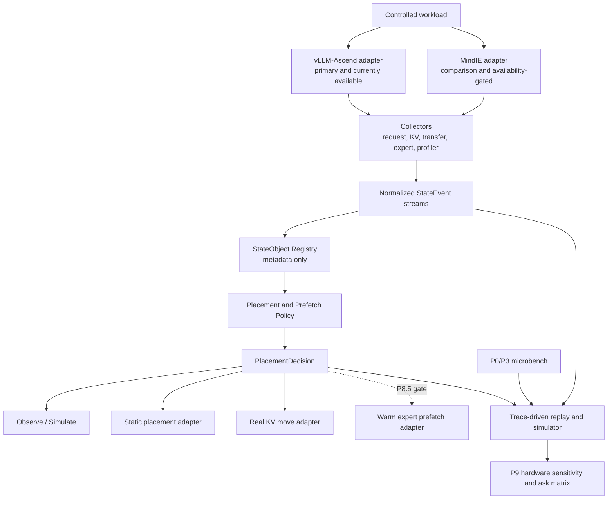

# P8 分层工程原型实施计划

日期：2026-07-10

状态：`planning_ready / implementation_not_started`

## 1. P8 的工程定义

P8 不以“找到一个现成框架并完成完整集成”为目标。当前没有证据表明存在一个可直接在本项目 Atlas 800T A2 / Ascend NPU 环境中同时完成 KV/Prefix 管理、MoE 专家热温冷分层、卸载、预取和硬件规格反推的生产级框架。

P8 的目标是建立一个**分层工程原型**：

> 以 vLLM-Ascend 为当前主运行底座，以 MindIE 为受 runtime availability 门控的对照底座；先复用可验证的 Prefix Cache、KV Cache CPU Offload、UCM / External KV Cache、EPLB 等能力，再自研一个不接管推理引擎的 `StateObject` 控制面，把 KV、Prefix、Expert、WeightShard、Session 的元数据、生命周期、位置、成本和策略统一起来；MoE 先完成 trace、hotness、static placement 和模拟分层，只有证据门通过后才进入真实 DRAM→HBM warm prefetch；最后把真实 trace、microbench 和策略事件交给 trace-driven simulator，由 P9 扫描硬件参数。

这里的 `StateObject`、热层/温层/冷层是项目内抽象，不是外部标准术语。对外术语仍使用 KV Cache CPU Offload、External KV Cache、Prefix Cache、MoE Expert Offload / Expert Cache、HBM / DRAM / SSD-NVMe tier 等。

## 2. 当前事实与能力边界

### 2.1 当前服务器事实

| 项目 | 当前证据 | P8 解释 |
| --- | --- | --- |
| vLLM-Ascend | `obs_2026_0705_atlas800t_a2_006` 记录 `vllm_ascend_version=0.18.0`；P1 已跑通 vLLM OpenAI API 和 Prefix Cache A/B | 当前主运行底座 |
| MindIE | 同一轮体检为 `mindie_version=unknown`，P1 package inventory 记录 `mindie=missing` | 不能写成当前可执行底座；需单独关闭 availability gate |
| DeepSeek-V4-Flash | P5 正在按 W8A8-MTP 八卡与 128K context ladder smoke 交接 | P8 不绕过 P5/P6 直接修改模型执行路径 |
| KV/Prefix object trace | 当前有 server stats proxy、phase memory、H2D/D2H microbench 和统一事件契约 | 尚无 object bytes、真实 hit/miss、restore/recompute 闭环 |
| Expert trace | 当前无 DeepSeek-V4-Flash router top-k / per-expert trace 闭环 | P8.3 必须先观测，再谈分层 |
| SSD cold tier | 已有 fio envelope | 只能校准冷层；不能证明逐 token restore 可用 |

### 2.2 框架能力只先登记为候选

截至 2026-07-10，vLLM-Ascend 最新官方资料包含 KV Cache CPU Offload、UCM Store、KV Cache Pool、EPLB 和 Weight Prefetch 等入口；MindIE 2.3 官方资料包含 Prefix Cache、KV Cache 池化、专家热点采集和冗余专家部署等机制。但是：

- 最新官方文档不等于服务器 `vLLM-Ascend 0.18.0` 已包含同一接口和参数。
- 官方功能存在不等于它支持 DeepSeek-V4-Flash W8A8-MTP、当前 CANN 版本和本项目 workload 组合。
- MindIE 官方能力存在不等于当前服务器已安装 MindIE，也不授权本轮安装或升级。
- vLLM-Ascend Weight Prefetch 是设备侧权重/L2 预取优化入口，不等于 CPU/SSD 专家卸载框架。
- EPLB 是专家负载均衡、复制和放置支点，不等于完整的专家热温冷卸载和回温系统。

因此 P8.0 必须先生成 `runtime_capability_matrix.yaml`，每项只能取以下状态之一：

```text
unsupported
documented_unverified
available_uninstrumented
instrumented
validated_for_selected_workload
```

任何 `documented_unverified` 项都不能进入性能收益结论。

## 3. 总体架构



职责边界：

- 推理引擎负责模型执行、scheduler、cache manager、expert dispatch 和真实 tensor payload。
- Runtime Adapter 只做能力探测、配置翻译、hook 接入和受控动作，不另写一个推理引擎。
- `StateObject Registry` 管理元数据和证据引用，不复制或持有模型权重/KV payload。
- Policy 只输出 `PlacementDecision`；是否能执行由 adapter capability 决定。
- Simulator 可以消费未执行的决策做 what-if，但模拟结果必须和真实实验结果分层标记。

## 4. 统一对象与事件契约

### 4.1 StateObject

`StateObject` 是项目内部控制面对象，只描述“是什么、在哪里、何时会再用、移动/重算代价是多少”。最小字段：

```yaml
schema_name: ak_state_object
schema_version: 0.2.0

object_id: string
object_type: kv_block | prefix_block | expert_weight | weight_shard | session
model_id: string
layer_id: int | null
expert_id: int | null
owner_request_id: string | null
session_id: string | null
scope: request | session | model | global

payload_ref: opaque_runtime_reference | null
bytes: int | null
precision: string | null
layout: string | null
checksum_or_version: string | null

current_tier: hbm | dram | pinned_dram | ssd | remote | unknown
current_rank: int | null
target_tier: hbm | dram | pinned_dram | ssd | remote | none

hotness_score: float | null
reuse_distance: int | null
next_use_estimate_ms: float | null

load_cost_ms: float | null
evict_cost_ms: float | null
recompute_cost_ms: float | null
prefetch_lead_time_ms: float | null

hit_count: int
miss_count: int
last_access_ts_ns: int | null
evidence_source: runtime_event | server_stats | profiler | derived | simulated
quality_risk: none | low | medium | high
```

设计约束：

- `Trace` 不是 `object_type`。Trace 是描述对象生命周期和策略决策的事件流。
- `WeightShard` 与 `Expert` 分开：前者描述 checkpoint/runtime shard，后者描述有路由语义的 expert weight。
- 未知真实字节数时写 `null`，不能用 whole-device HBM 或 tensor footprint 代替。
- `payload_ref` 必须是 runtime 内部不透明引用；控制面不得私自复制 tensor。

### 4.2 StateEvent

在现有 `工作记录与进度笔记本/p1_inference_contracts/state_object_event_schema.yaml` 基础上规划 0.2.0 扩展：

```yaml
event_type: request_stage | state_lifecycle | transfer | expert_route | policy_decision
timestamp_ns: int
trace_id: string
request_id: string | null
session_id: string | null
object_id: string | null
runtime: vllm_ascend | mindie | simulator
rank_id: int | null
phase: prefill | decode | idle | unknown
action: string
source_tier: string | null
target_tier: string | null
bytes: int | null
latency_ms: float | null
reason: string
evidence_source: string
```

### 4.3 PlacementDecision

```yaml
decision_id: string
object_id: string
policy_name: string
policy_version: string
action: keep | prefetch | offload | restore | evict | recompute | no_op
source_tier: string
target_tier: string
issued_ts_ns: int
deadline_ts_ns: int | null
expected_benefit_ms: float | null
expected_cost_ms: float | null
confidence: float | null
execution_mode: observe_only | simulate_only | static_placement | real_move
executed: bool
execution_result: success | failed | skipped | unsupported
```

所有策略必须同时记录“不动作”决策，避免只保留成功预取造成选择偏差。

## 5. Runtime Adapter 边界

### 5.1 vLLM-Ascend Adapter

优先级：

1. 使用已有 server stats、KV events、公开 connector/config 和 EPLB 日志/导出。
2. 通过稳定 hook 或 wrapper 补齐事件。
3. 只有前两种无法提供最低 trace 粒度时，才提出小范围 runtime patch；patch 必须单独建实验分支和对照，不直接混入 baseline。

首批能力探测：

```text
prefix_cache
kv_cache_events
OffloadingConnector + NPUOffloadingSpec
UCMConnector / UCM config
EPLB recording + static expert map
expert hotness metrics
weight prefetch
```

### 5.2 MindIE Adapter

MindIE 不是当前 P8 的阻塞项。只有同时满足以下条件才进入实测对照：

- 服务器已有经用户确认的 MindIE 安装或独立可复现环境。
- 版本、模型支持矩阵、配置和许可证/使用边界已记录。
- 不破坏当前 vLLM-Ascend host conda 基线。
- 能输出与 vLLM-Ascend 对齐的 request、Prefix/KV、expert hotness、memory 和 latency 字段。

否则仅保留官方能力对照表，不安排安装任务，不把 MindIE 数字和 vLLM 数字直接拼成 A/B。

## 6. P8 分阶段垂直切片

### P8.0：Baseline Freeze 与 Capability Probe

目标：冻结可比较基线，确认“哪些能力在当前版本真实存在”。

输入门：

- P5 至少为 `yellow`，且八卡至少一个请求成功；若 P5 为 `red`，P8 只能在小模型/中型 MoE 上做工具链预研。
- P6 已固定一个 unprofiled workload 和一个 profiled workload，二者不能混算性能。

交付物：

```text
benchmarks/deepseek_v4_flash/p8/runtime_capability_matrix.yaml
benchmarks/deepseek_v4_flash/p8/baseline_contract.yaml
p8_0_capability_probe_report.md
```

退出门：选中的 P8.1/P8.2 路径不能仍是 `documented_unverified`。

### P8.1：Observe-only StateObject Trace

目标：在不改变 placement 和 payload 的前提下，生成统一对象和事件流。

首个 tracer bullet：

```text
1 个成功 P6 workload
1 个 vLLM-Ascend runtime
request_stage + KV/prefix proxy + transfer + policy no_op
trace_validation_errors = 0
```

随后才扩展：

- KV block / prefix block lifecycle。
- session 与 shared-prefix 关系。
- request↔runtime↔device↔object join。
- expert aggregated hotness，再到可行时的 request/router 粒度。

验收：

- 每个成功请求都有 request start/end 与 prefill/decode 边界或明确的 `unknown` 原因。
- 每个 transfer event 都有 direction、bytes 或 `bytes=null + reason`。
- 每个策略决策都有 `execution_mode=observe_only` 和 `executed=false`。
- `trace_validation_errors=0`；未知字段进入 availability report，不用猜测值填充。

### P8.2：KV / Prefix 真实路径

目标：先证明 DRAM warm tier 路径可运行和可观测，再判断是否收益为正。

执行顺序：

| 子阶段 | 路径 | 目的 | 不输出 |
| --- | --- | --- | --- |
| K0 | Prefix Cache on/off baseline | 复用 P6 固定输出对照 | 不外推为 offload 收益 |
| K1 | KV Cache CPU Offload | 验证 HBM↔DRAM move、LRU、restore | 不默认 async overlap 成立 |
| K2 | UCM / External KV Cache，DRAM-first | 验证 external prefix/KV object、hit/miss | 不默认持久化后端更快 |
| K3 | SSD/NFS/3FS cold persistence | 验证重启恢复和冷层容量 | 不进入逐 token decode 热路径 |
| K4 | MindIE Prefix/KV Pool 对照 | 仅在 MindIE availability gate 关闭后执行 | 不跨 runtime 做不受控速度比较 |

首轮矩阵采用逐步放大，不一次做全排列：

```yaml
pilot:
  context: one_mid_context_that_passed_p6
  output_tokens: 64
  concurrency: 1
  prefix_pattern: exact_reuse

expand_after_pilot:
  context: [4K, mid_successful_context, highest_stable_context]
  output_tokens: [64, 256]
  concurrency: [1, 4, 8]
  prefix_pattern: [no_reuse, exact_reuse, partial_reuse]
  num_cpu_blocks: [500, 1000, 2000, 4000]
  block_size: [64, 128, 256]
```

实际矩阵只保留通过 host-memory 预算与 capability probe 的组合。

必采字段：

```text
NPU/CPU block count
object bytes or explicit unknown
NPU hit / CPU hit / external hit / miss
D2H/H2D bytes and latency
restore latency
recompute latency
copy stream and overlap evidence
HBM used/free and host DRAM
TTFT / TPOT / ITL / E2EL / P95/P99
fixed generated-token check
host OOM / timeout / eviction reason
```

P8.2 成功不等于性能提升。负收益但证据完整也是有效结论。

### P8.3：MoE Trace、Hotness 与 Static Placement

目标：先把专家访问分布、负载不均和复用距离测出来，再做可复现的静态放置/复制。

粒度分两级：

- Level A：EPLB 或 runtime 暴露的 per-layer/per-expert 聚合热度、expert map、负载和更新时间。
- Level B：request/session/layer/token 级 router top-k 与 score。只有 Level A 不足以回答策略问题时才增加 hook。

执行顺序：

1. 在中型 MoE 或 P6 可运行的 DeepSeek 路径上采集 Level A。
2. 生成 `expert_hotness_summary.parquet` 和 `expert_map_baseline.json`。
3. 计算 frequency、peak-to-average、reuse distance、top-N coverage 和 rank imbalance。
4. 使用 EPLB recording/static map 或等价 runtime 能力做 static placement/replication A/B。
5. 若仍需要预测粒度，再提出 Level B 最小 hook，不直接修改 expert load 路径。

边界：

- EPLB 结果只能证明 placement/load-balance 机制，不等于 expert offload。
- 未观测 expert bytes、load latency 和 miss penalty 时，不计算真实 warm/cold 收益。
- static map A/B 必须固定 workload、输出长度、rank mapping 和 server lifecycle。

### P8.4：Expert Tier V0（模拟分层）

目标：权重仍按 runtime 原路径驻留，只对“如果移动”做 trace replay 和成本建模。

V0 policy：

```text
Hot: 在给定 HBM budget 下，使 holdout trace weighted hit 最大的 expert set。
Warm: DRAM 中的候选 expert metadata / payload-size model，使用实测 H2D cost。
Cold: SSD/NVMe checkpoint 或低频 pool，只使用实测大块 I/O 成本。
```

至少比较：

```text
static_frequency
exponential_moving_average
session_aware
layer_budgeted
oracle_upper_bound
```

训练窗口与评估窗口必须分开；oracle 只作为上界，不能作为可部署策略。

交付物：

```text
expert_tier_v0_policy.yaml
expert_tier_v0_replay.parquet
expert_tier_v0_simulation_report.md
expert_miss_penalty_curve.tsv
```

### P8.5：Expert Warm Prefetch V1（条件式真实原型）

只有同时满足以下门槛才启动：

- P8.3 有稳定 expert identity、hotness 和 placement trace。
- expert payload bytes 与 DRAM→HBM load latency 已实测或能由同形状 tensor microbench 校准。
- holdout trace 中 `prefetch_lead_time_p95` 大于 `load_latency_p95 + safety_margin`。
- wrong-prefetch bytes、HBM staging budget 和 eviction churn 有上限。
- runtime adapter 能在不破坏 baseline 的独立实验路径执行 move。

V1 只做：

```text
DRAM warm staging -> HBM prefetch -> execute -> bounded eviction
```

V1 不做：

- SSD→HBM 逐 token 随机恢复。
- CPU 执行主干 expert 代替 NPU。
- 在同一轮同时改变预测器、tier budget、量化格式和并行策略。
- 生产级 fault tolerance、跨节点一致性或通用模型支持。

### P8.6：P9 Trace Bundle Handoff

P8 不在本阶段直接输出下一代硬件结论。它向 P9 提供：

```text
normalized state events
runtime capability matrix
KV/prefix hit-miss and restore cost
expert hotness and miss penalty
placement decisions and outcomes
microbench calibration references
measured/simulated provenance
known missing fields and confidence
```

P9 才负责 sensitivity sweep、bottleneck attribution 和 hardware ask ranking。

## 7. 执行模式与安全阀

| 模式 | 是否改变 runtime placement | 用途 | 默认级别 |
| --- | --- | --- | --- |
| `observe_only` | 否 | 采集、规范化、join | P8.1 默认 |
| `simulate_only` | 否 | replay、policy what-if | P8.4 默认 |
| `static_placement` | 是，启动时固定 | EPLB/expert map、可复现实验 | P8.3 条件开启 |
| `real_move` | 是，运行时移动 | KV offload/UCM；后期 warm expert prefetch | 逐能力门开启 |

全局安全阀：

- 任一 adapter 不支持目标动作时必须返回 `unsupported`，不能静默降级成另一种动作。
- 任一 payload move 失败后优先回到 baseline/recompute 路径，并记录 correctness 风险。
- 任何质量错误、token mismatch、request failure 都使该轮性能数据失去 A/B 证明力。
- raw trace、模型输出和 profiler 产物留服务器；邮件只回传 70KB 内摘要和路径。

## 8. 指标、验收与结论等级

### 8.1 四组指标

1. **Correctness**：request success、generated token control、checksum/version、fallback、trace validation。
2. **Capacity**：HBM headroom、host DRAM、state bytes、hotset coverage、eviction churn。
3. **Latency/throughput**：TTFT、TPOT、ITL、E2EL、request/output throughput、P95/P99。
4. **Mechanism**：hit/miss、restore/recompute、D2H/H2D、overlap、expert miss penalty、wrong-prefetch bytes。

### 8.2 结论等级

| 等级 | 需要的证据 | 可输出 |
| --- | --- | --- |
| `path_smoke` | 路径可运行、请求成功、配置完整 | 功能可运行 |
| `instrumented_path` | object/event trace 可 join | 机制发生了什么 |
| `controlled_ab` | 固定 workload/输出/环境，只改一变量 | 方向性差异 |
| `calibrated_simulation` | trace + microbench + holdout 校准 | what-if 区间 |
| `hardware_recommendation` | P6/P7/P8/P9 证据闭合 | 带置信度的硬件优先级 |

不得从低等级跨级输出高等级结论。

## 9. 计划中的代码与产物边界

本轮只定义，不创建以下代码骨架：

```text
tools/ak_state_runtime/
  schema/
  adapters/
    vllm_ascend/
    mindie/
  collectors/
  registry/
  policies/
  replay/

tests/ak_state_runtime/

benchmarks/deepseek_v4_flash/p8/
  runtime_capability_matrix.yaml
  baseline_contract.yaml
  experiment_cards/
  policies/
```

未来实现时，每个 vertical slice 必须同时提供：

- adapter contract/unit test。
- trace schema fixture/validator。
- deterministic replay test。
- 一个小模型或离线 fixture smoke。
- 一个服务器受控实验卡。
- 一个失败/降级样例。

## 10. P8 必交付物

```text
1. runtime_capability_matrix.yaml
2. ak_state_object.schema.yaml
3. ak_state_event.schema.yaml
4. p8_baseline_contract.yaml
5. kv_cpu_offload_experiment_card.yaml
6. ucm_prefix_experiment_card.yaml
7. expert_hotness_summary.parquet
8. expert_map_baseline.json
9. expert_tier_v0_simulation_report.md
10. p9_trace_bundle_manifest.yaml
```

条件交付物：

```text
11. mindie_comparison_card.yaml
12. expert_warm_prefetch_v1_report.md
```

MindIE 未通过 availability gate 或 Expert V1 未通过证据门时，条件交付物应标为 `not_started_by_gate`，不算 P8 失败。

## 11. P8 完成定义

P8 只有在以下条件同时成立时才算完成：

- 至少一个 Ascend runtime 完成 capability probe 和可复现 baseline freeze。
- KV/Prefix 至少有一个真实 DRAM warm-tier 路径达到 `instrumented_path`。
- MoE 至少完成 expert hotness、static placement 和 holdout-based tier simulation。
- `StateObject`、`StateEvent`、`PlacementDecision` 能在同一 trace bundle 中 join。
- 所有测量值和模拟值有 provenance，负收益和失败路径没有被删掉。
- P9 能直接消费 trace bundle，不需要从 Markdown 手工抄数字。

不要求生产级完整 KV/Prefix 框架、不要求生产级专家热温冷卸载、不要求 NPU-SSD 直通、不要求 CPU 主算、不要求完整物理 P/D 分离。

## 12. 来源与版本说明

本计划的术语和机制优先对齐：

- 本地路由索引：`AK 协同/references/bibliography_inference_sim.md`。
- 本地官方快照：`AK 协同/references/web/vLLM-Ascend-KV-CPU-offload-live.html`、`vLLM-Ascend-UCM-deployment-live.html`、`vLLM-Ascend-release-notes-live.html`、`MindIE-docs.html`。
- vLLM-Ascend 官方：[KV Cache CPU Offload](https://docs.vllm.ai/projects/ascend/en/latest/user_guide/feature_guide/kv_cache_cpu_offload.html)、[UCM Store](https://docs.vllm.ai/projects/ascend/en/latest/user_guide/feature_guide/ucm_deployment.html)、[EPLB](https://docs.vllm.ai/projects/ascend/en/latest/user_guide/feature_guide/eplb_swift_balancer.html)、[Weight Prefetch](https://docs.vllm.ai/projects/ascend/en/latest/user_guide/feature_guide/weight_prefetch.html)。
- MindIE 2.3 官方：[Prefix Cache](https://www.hiascend.com/document/detail/zh/mindie/230/mindiellm/llmdev/mindie_llm0302.html)、[KV Cache 池化](https://www.hiascend.com/document/detail/zh/mindie/230/mindiellm/llmdev/mindie_llm0538.html)、[冗余专家部署表生成](https://www.hiascend.com/document/detail/zh/mindie/230/mindiellm/llmdev/mindie_llm0431.html)。

MindIE 三个特性页是本轮 live official 核对结果，当前 `AK 协同/` 尚无对应的逐页本地快照，应标记为 `pending_local_snapshot_alignment`；在快照补齐或服务器版本确认前，只作为能力候选，不作为本机结果证据。
