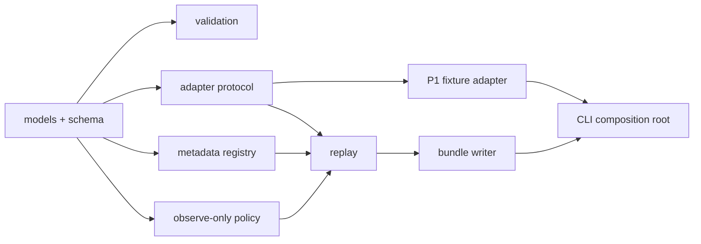

# P8 Observe-only State Runtime 第一垂直切片设计

日期：2026-07-10

状态：`design_ready / implementation_not_started`

## 1. 目标

本设计定义 P8 的第一条本地垂直切片：在不依赖 Ascend 服务器、不导入
vLLM/vLLM-Ascend、不移动任何 KV/Expert payload 的前提下，把既有 P1
runtime trace 转换为可校验、可回放、可追溯的：

```text
StateObject + StateEvent + PlacementDecision + TraceBundle
```

该切片是 P8 工具链预研，不关闭 P8.0 capability gate，也不把 P8.1 标记为
服务器验证完成。它只证明项目自研控制面的模块接口可以端到端贯通。

## 2. 已确认的工程策略

采用“集成优先、薄层自研”：

- vLLM/vLLM-Ascend 继续负责模型执行、scheduler、KV manager、expert dispatch
  和真实 tensor payload。
- UCM、LMCache-Ascend、Mooncake、EPLB 等能力以后通过 adapter 或受控上游
  patch 接入；本切片不复制这些实现。
- FineMoE、KTransformers、NEO、Chakra、LLMServingSim、ServeGen 等仓库先作
  机制、trace 和 simulator 参考；代码复用必须另过许可证、版本接口和 Ascend
  适配门。
- AK 自研内容只包括跨运行时契约、adapter 接缝、metadata registry、策略决策
  记录、确定性 replay、bundle 和证据边界。

### 2.1 比较过的三种路径

| 路径 | 优点 | 风险 | 结论 |
| --- | --- | --- | --- |
| 从头写完整推理与分层运行时 | 完全可控 | 重复实现 scheduler/cache/transfer，范围失控 | 不采用 |
| 直接 fork vLLM-Ascend 开始打 hook | 最快接触真实 runtime | 当前服务器版本仍在升级，核心契约会被具体实现绑死 | 后置到 capability probe 之后 |
| 独立 core + runtime adapters | 可离线推进，第三方实现可替换，便于测试 | 需要先定义稳定边界 | 采用 |

## 3. 第一切片的范围

### 3.1 包含

1. 三个 0.2.0 契约：`StateObject`、`StateEvent`、`PlacementDecision`。
2. 一个只读 P1 fixture adapter。
3. 一个只保存 metadata 的 registry。
4. 一个只输出 `no_op` 的 observe-only policy。
5. 一个确定性 replay pipeline。
6. 一个小型 trace bundle writer 和 validator。
7. 正常 fixture、失败 fixture、单元测试和已生成的小型示例 bundle。

### 3.2 不包含

- vLLM/vLLM-Ascend、torch、torch-npu、CANN 或 NPU import。
- 服务器 capability probe、DeepSeek 模型加载或请求。
- KV Cache CPU Offload、UCM、EPLB 或 Expert payload move。
- 性能 benchmark、收益结论或 P9 hardware ask。
- 对既有 P1 schema 的原地升级或语义改写。

## 4. 模块结构与依赖方向

```text
tools/ak_state_runtime/
  __init__.py
  models.py
  schema/
    ak_state_object.schema.yaml
    ak_state_event.schema.yaml
    placement_decision.schema.yaml
  validation.py
  adapters/
    __init__.py
    base.py
    p1_fixture.py
  registry.py
  policies/
    __init__.py
    observe_only.py
  replay.py
  bundle.py
  cli.py

tests/ak_state_runtime/
  test_schema_validation.py
  test_p1_fixture_adapter.py
  test_registry.py
  test_observe_only_policy.py
  test_replay_bundle.py
  fixtures/
    duplicate_event_id.jsonl
    missing_trace_id.jsonl

benchmarks/deepseek_v4_flash/p8/offline_tracer_bullet/
  manifest.yaml
  state_objects.jsonl
  state_events.jsonl
  placement_decisions.jsonl
  validation_report.json
```

依赖规则：



硬约束：

- `models.py` 和 `schema/` 不导入任何运行时、项目旧模块或 I/O 实现。
- `registry.py`、`policies/` 只依赖 core models。
- `replay.py` 只面向 adapter protocol，不识别 P1、vLLM 或 MindIE。
- 只有 `adapters/p1_fixture.py` 可以理解 P1 0.1.0 字段。
- 只有 `cli.py` 负责选择具体 adapter、输入路径和输出路径。
- 未来 `vllm_ascend`、UCM、MindIE adapter 作为并列模块加入，不允许反向修改
  core 来容纳某个第三方私有类型。
- `reference_repos/` 保持只读且不进入 Python import path。

## 5. 核心接口

接口使用标准库 dataclass 和 `typing.Protocol`；第一切片不引入 Pydantic 等新依赖。

### 5.1 Models

```python
@dataclass(frozen=True)
class StateEvent:
    schema_version: str
    event_id: str
    timestamp_ns: int
    trace_id: str
    request_id: str | None
    session_id: str | None
    object_id: str | None
    object_type: str | None
    model_id: str
    runtime: str
    rank_id: int | None
    layer_id: int | None
    phase: str
    event_type: str
    action: str
    source_tier: str | None
    target_tier: str | None
    bytes: int | None
    latency_ms: float | None
    source_event_id: str
    evidence_source: str
    artifact_path: str
    reason: str


@dataclass
class StateObject:
    schema_version: str
    object_id: str
    object_type: str
    model_id: str
    layer_id: int | None
    expert_id: int | None
    owner_request_id: str | None
    session_id: str | None
    scope: str
    payload_ref: str | None
    bytes: int | None
    precision: str | None
    layout: str | None
    checksum_or_version: str | None
    current_tier: str
    current_rank: int | None
    target_tier: str
    hotness_score: float | None
    reuse_distance: int | None
    next_use_estimate_ms: float | None
    load_cost_ms: float | None
    evict_cost_ms: float | None
    recompute_cost_ms: float | None
    prefetch_lead_time_ms: float | None
    hit_count: int
    miss_count: int
    last_access_ts_ns: int | None
    evidence_source: str
    quality_risk: str


@dataclass(frozen=True)
class PlacementDecision:
    schema_version: str
    decision_id: str
    object_id: str
    policy_name: str
    policy_version: str
    action: str
    source_tier: str
    target_tier: str
    issued_ts_ns: int
    deadline_ts_ns: int | None
    expected_benefit_ms: float | None
    expected_cost_ms: float | None
    confidence: float | None
    execution_mode: str
    executed: bool
    execution_result: str
    reason: str
```

Python models 与三个 YAML contract 保持同名字段；枚举只在 schema 中定义，
validator 从 schema 装载枚举并校验 models，避免在代码中维护第二套枚举来源。
第一切片不能观测到的字段显式写 `None` 或 schema 规定的 `unknown/none`，不能从
fixture 邻近字段推断填充。

### 5.2 Adapter protocol

```python
class RuntimeEventAdapter(Protocol):
    def read(self, source: Path) -> AdaptedTrace:
        """Return normalized events plus explicit warnings and skipped records."""
```

`AdaptedTrace` 至少包含：

```text
events
source_record_count
emitted_event_count
skipped_record_count
warnings
```

adapter 不写文件、不更新 registry、不执行策略。

### 5.3 Registry

```python
class StateRegistry:
    def apply(self, event: StateEvent) -> None: ...
    def snapshot(self) -> tuple[StateObject, ...]: ...
```

Registry 只管理 metadata：

- `object_id=None` 的 request-stage event 不创建对象。
- object 第一次出现时创建记录。
- `target_tier` 非空时更新 `current_tier`。
- hit/miss action 更新计数。
- 只有无歧义的 object bytes 才进入 `StateObject.bytes`。
- 不保留 tensor、内存地址或可执行 runtime handle。

### 5.4 Policy

```python
class ObserveOnlyPolicy:
    def decide(self, event: StateEvent) -> PlacementDecision | None: ...
```

- 只为 `object_id` 非空的 event 生成 decision。
- 始终返回 `action=no_op`、`execution_mode=observe_only`、
  `executed=false`、`execution_result=skipped`。
- decision ID 由 source event ID 确定性派生，不使用随机 UUID。

### 5.5 Replay

```python
def replay(
    adapted: AdaptedTrace,
    registry: StateRegistry,
    policy: ObserveOnlyPolicy,
) -> ReplayResult: ...
```

Replay 按 `(timestamp_ns, event_id)` 稳定排序，依次更新 registry 和生成 decision。
同一输入重复执行必须得到逐字节相同的 JSONL 与 manifest digest。

## 6. P1 fixture 映射规则

输入为：

```text
工作记录与进度笔记本/p1_inference_contracts/fixtures/minimal_runtime_trace.jsonl
```

P1 0.1.0 是只读输入契约；不在原文件中添加 P8 字段。

| P1 条件 | P8 event_type | 处理 |
| --- | --- | --- |
| `resource_scope=request_runtime_profile` | `request_stage` | 保留 request/session/phase，`object_id=null` |
| `resource_scope=transfer_overlap_profile` | `transfer` | 保留 source/target tier、latency 和 object join key |
| 有 `object_id` 的 operator/state record | `state_lifecycle` | 映射 KV/Prefix object，保留 source event ID |
| 未知 resource scope | 不静默猜测 | skip 并写入 warning/availability report |

对象类型映射：

```text
kv     -> kv_block
prefix -> prefix_block
```

字节数规则：

- `bytes_read > 0, bytes_write = 0`：使用 `bytes_read`。
- `bytes_write > 0, bytes_read = 0`：使用 `bytes_write`。
- 二者相等且大于零：使用该值。
- 二者不同且均大于零：写 `bytes=null`，reason 记录
  `ambiguous_read_write_bytes`，禁止猜成 object bytes。

输入 fixture 的 runtime label 由 CLI 显式传入；bundle 同时固定：

```yaml
provenance_mode: offline_fixture
server_validated: false
claim_level: toolchain_only
```

因此它不能被解释为当前 vLLM-Ascend 版本或 Atlas 800T A2 的实测结果。

## 7. 数据流

```text
P1 JSONL fixture
  -> legacy input validation
  -> P1FixtureAdapter
  -> normalized StateEvent list
  -> schema validation
  -> deterministic replay
       -> StateRegistry snapshot
       -> ObserveOnlyPolicy decisions
  -> cross-reference validation
  -> TraceBundle files + digests
```

跨引用验收：

- 每个 decision 的 `object_id` 必须存在于 object snapshot。
- 每个 object 必须至少被一个 event 引用。
- event ID、decision ID 必须唯一。
- request-stage event 可以没有 object；其他进入策略的 event 必须有 object。
- source event ID 与 artifact path 必须保留，不能只留下派生结论。

## 8. 错误和降级行为

| 情况 | 行为 |
| --- | --- |
| JSONL 不是 mapping 或缺 `trace_id/event_id/timestamp_ns` | 失败，不生成 bundle |
| event ID 重复 | 失败，不生成 bundle |
| 未支持的 object type/resource scope | 记录 skip 和原因；manifest 标记不完整 |
| bytes 无法无歧义确定 | 保留 event，`bytes=null`，记录原因 |
| target tier 缺失 | object tier 保持 `unknown`，不猜测 |
| schema 或 cross-reference 校验失败 | CLI 非零退出；不宣称 tracer bullet 通过 |

第一切片没有执行器，因此不存在自动 fallback、payload rollback 或静默切换
runtime。未来 real-move adapter 的错误策略必须独立设计，不能塞进 core replay。

## 9. Bundle contract

生成目录只包含小型文本产物：

```text
manifest.yaml
state_objects.jsonl
state_events.jsonl
placement_decisions.jsonl
validation_report.json
```

`manifest.yaml` 至少记录：

```yaml
schema_version: 0.2.0
slice_id: p8_offline_observe_only_tracer_bullet
source_artifact: string
source_sha256: string
provenance_mode: offline_fixture
runtime_label: string
server_validated: false
claim_level: toolchain_only
source_record_count: int
emitted_event_count: int
skipped_record_count: int
state_object_count: int
placement_decision_count: int
trace_validation_errors: int
artifact_sha256: mapping
```

示例 bundle 由 CLI 生成并提交，禁止手改。测试在临时目录重新生成并与示例
bundle 比较 digest。

## 10. 测试设计与成功标准

### 10.1 单元测试

1. 三个 schema 可装载，required fields 和 enum 完整。
2. P1 adapter 对现有 8 行 fixture 输出：
   - 8 个 normalized events；
   - 3 个 request-stage events；
   - 1 个 transfer event；
   - 2 个最终 StateObjects：KV 与 Prefix。
3. Registry 最终状态：
   - Prefix：`hit_count=1`、`current_tier=hbm`、`bytes=524288`；
   - KV：`miss_count=1`、`current_tier=hbm`、`bytes=1048576`。
4. 所有 object-bearing events 都生成 `no_op` decision，且全部
   `executed=false`。
5. 重放两次的 bundle 文件逐字节一致。
6. duplicate event ID 和 missing trace ID fixture 必须失败且不输出成功 manifest。

### 10.2 回归验证

```bash
python -m pytest tests/ak_state_runtime -q
python -m pytest tests/inference_contracts -q
python -m pytest -q
git diff --check
```

### 10.3 第一切片完成定义

- `tests/ak_state_runtime` 全部通过。
- 现有测试无回归。
- 示例 bundle 可由单一 CLI 命令确定性重建。
- `trace_validation_errors=0`、`server_validated=false`、
  `claim_level=toolchain_only` 同时存在。
- core 模块的 import graph 中没有 vLLM、vLLM-Ascend、torch、torch-npu、
  CANN 或 `reference_repos`。
- 未修改服务器交接文档，未把 fixture 结果写成服务器事实。

## 11. 后续扩展边界

第一切片通过后，按以下顺序扩展，每一步保持独立 adapter：

1. 目标 tag source capability probe，填充 `runtime_capability_matrix.yaml`。
2. 服务器升级回传后加入 `VllmAscendAdapter`，先只读 server stats / public
   event/export。
3. capability 允许时加入 KV CPU Offload/UCM collector；core schema 不随 connector
   私有类型变化。
4. EPLB/export 可用后加入 expert aggregated hotness adapter。
5. 只有公开接口不足时，才提出独立 vLLM-Ascend patch 分支和 A/B；patch 不进入
   core 包。

MindIE、真实 payload move、warm expert prefetch 和 simulator policy 均不是本切片
的隐含交付物。
